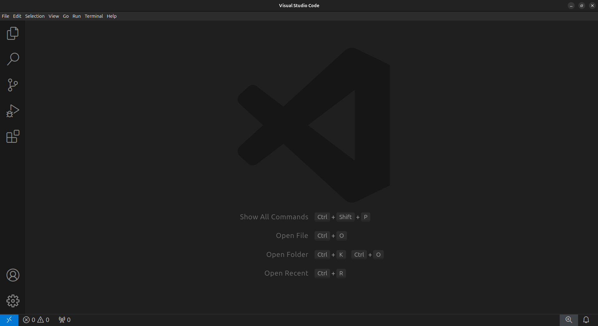
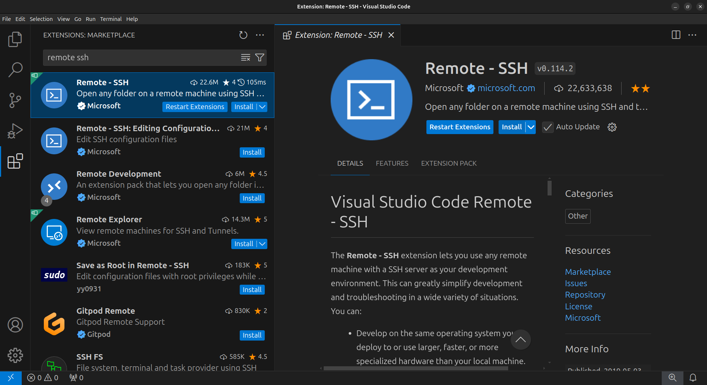

# Set up your computer

In this workshop, we will be using [Pawsey's Setonix HPC](https://pawsey.org.au/systems/setonix/) and [NCI's Gadi HPC](https://nci.org.au/our-systems/hpc-systems). 

The requirements for this workshop are a personal computer with:

- Visual Studio Code (VSCode)
- A web browser

Below, you will find instructions on how to set up VSCode and connect to the HPC system to which you've been assigned

.
Each participant will be provided with their training account and password prior to the workshop.
Before the workshop, you must have the following:

1. VSCode installed
2. The necessary VSCode extensions installed
3. Be able to connect to your assigned HPC.

!!! info

    If you require assistance with the setup, please write in the discussion board on the Google document.

## Installing Visual Studio Code

Visual Studio Code (VSCode) is a versatile code editor that we will use for the
workshop. We will use VSCode to connect to the VM, navigate the directories,
edit, view and download files.

1. Download VSCode by following the [installation instructions](https://code.visualstudio.com/docs/setup/setup-overview) for your local Operating System.
2. Open VSCode to confirm it was installed correctly.

## Installing the VSCode extensions

Specific VSCode extensions are required to connect to the VM and make working with Nextflow files easier (i.e. syntax highlighting).

1. In the VSCode sidebar on the left, click on the extensions button (four blocks)
2. In the Extensions Marketplace search bar, search for `remote ssh`. Select **"Remote - SSH"**

3. Click on the blue `Install` button

4. Search for `nextflow` and install the **"Nextflow"** extension

5. Close the Extensions tab and sidebar

## Connecting to the HPCs

Ensure you have your training details of your assigned system. 

### Connect to Gadi TODO 
### Connect to Setonix TODO 

## Configuring VSCode for the workshop

!!! success

    You have now configured VSCode for the workshop!