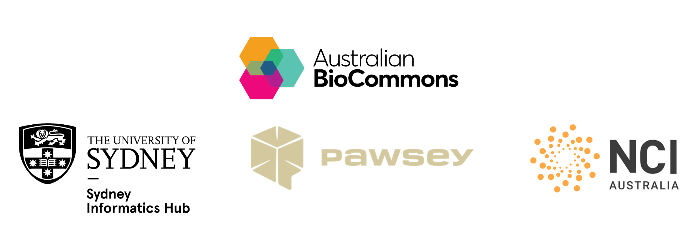

# Nextflow and HPC

This workshop is delivered over 2 3-hour sessions that cover how HPC works, to running and optimising workflows on it using Nextflow and nf-core.

We work through a realistic experimental scenario: adapting a whole genome variant calling workflow to run on high performance computing (HPC) infrastructure. Each lesson connects foundational HPC concepts to workflow design and configuration in Nextflow.

This workshop is delivered concurrently on Australia's Tier-1 HPCs; [NCI's Gadi HPC](https://nci.org.au/our-systems/hpc-systems) and [Pawsey's Setonix HPC](https://pawsey.org.au/systems/setonix/).

## Developers

- Michael Geaghan, Sydney Informatics Hub, University of Sydney
- Fred Jaya, Sydney Informatics Hub, University of Sydney
- Mitchell O'Brien, Sydney Informatics Hub, University of Sydney
- Georgie Samaha, Sydney Informatics Hub, University of Sydney
- Cali Willet, Sydney Informatics Hub, University of Sydney

## Facilitators

- Giorgia Mori, Australian BioCommons
- Sarah Beecroft, Pawsey Supercomputing Research Centre
- Kisaru Liyanage, National Computational Infrastructure
- Cali Willet, Sydney Informatics Hub, University of Sydney
- Kristina Gagalova, Curtin University
- Gayatri Aniruddha, University of Western Australia

## Prerequisites

This is an intermediate-advanced workshop for people developing reproducible bioinformatics workflows to run on HPC. It assumes experience with the following:

- Running and developing Nextflow workflows
- Working in a Linux environment using basic scripting (e.g. Bash)
- Working on a HPC cluster.

Attendees would benefit from having previously completed our [Nextflow for the Life Sciences workshop](https://sydney-informatics-hub.github.io/hello-nextflow-2025/).

## Set up requirements

Please see our [set up instructions](./setup.md) to set up your laptop for this workshop.

## Code of Conduct

In order to foster a positive and professional learning environment we encourage the following kinds of behaviours at all our events and on our platforms:

- Use welcoming and inclusive language
- Be respectful of different viewpoints and experiences \* Gracefully accept constructive criticism
- Focus on what is best for the community
- Show courtesy and respect towards other community members.

## Workshop schedule

TODO add schedules.

## Course survey

## Credits and acknowledgements

We gratefully acknowledge the contributions of Abdullah Shaikh, Ludovic Capelli, Ziad Al-Bkhetan, Melissa Burke, Magda Antczak, Wenjing Xue, and Matthew Downton.

This workshop event and accompanying materials were developed by the [Sydney Informatics Hub](https://www.sydney.edu.au/research/facilities/sydney-informatics-hub.html), University of Sydney in collaboration. The workshop was enabled by Australian BioCommons' [BioCLI Platforms Project](https://www.biocommons.org.au/biocli) (NCRIS via Bioplatforms Australia).

