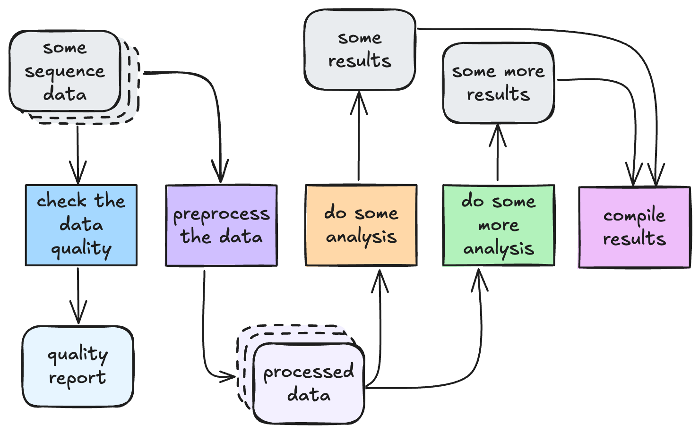
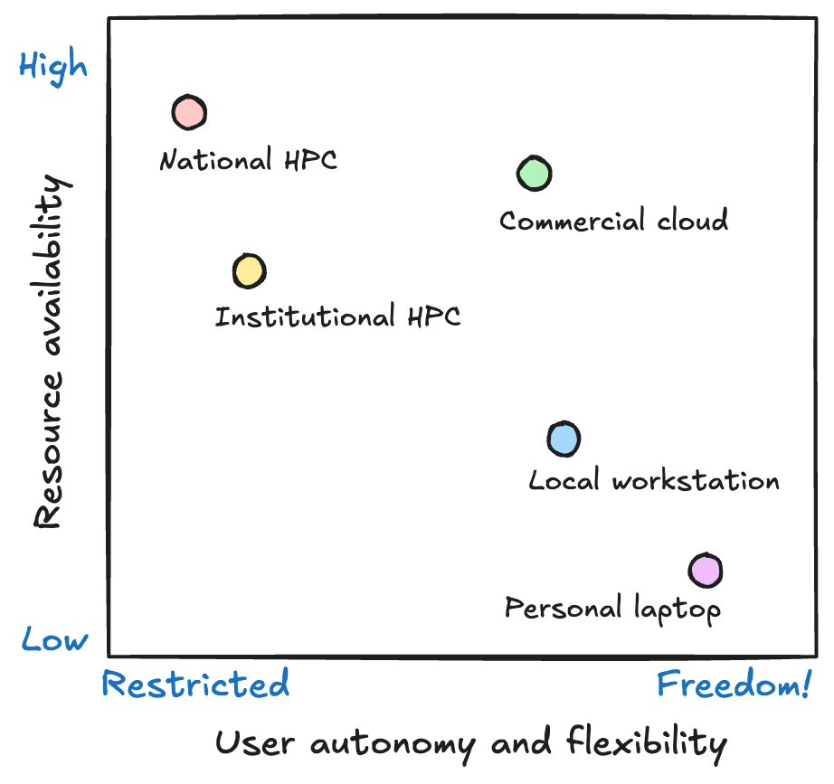

# HPC for bioinformatics workflows

!!! info "Learning objectives"

    - Describe the HPC system components that workflows interact with.
    - Identify why containerisation and resource-aware design are essential for scalable workflows.
    - Describe how HPC scheduling and resource limitations shape pipeline configuration.
    - Connect HPC principles to the Nextflow workflow management systems.

High Performance Computing (HPC) systems are built to run large numbers of computational jobs efficiently. Bioinformatics analysis often involves many steps, many tools, and many samples, making it a perfect match for HPC. However, HPCs expect work to be submitted in a particular way, following specific rules. This means our workflows often need to be designed for HPC, not just moved to HPC.

## When does a workflow need HPC?

In bioinformatics, a workflow is simply a defined series of steps that take data as input and transform that data into processed data and/or analytical results. This is true whether you are doing whole genome variant calling, proteomics quantification, single-cell transcriptomics, or metagenomics assembly. Each step in the pipeline performs one job, and each job depends on some form of computation and storage.

But workflows don’t always need HPC. Many can run perfectly well on a laptop or a small workstation during development or for small datasets. 

### Signs your workflow is ready for HPC

TODO this is not very good, can come up with some better examples here, can be communicated better. 

| Challenge | Scenario |
|-----------|----------|
| Runtime is too long | A single sample takes >12 hours to process |
| Data size is too big | Multiple large FASTQs to be processed |
| Memory limits hit | R or Python crashes loading matrices |
| Scaling samples manually is painful | Running multiple scripts across multiple samples |
| Storage is a bottleneck | Local disk constantly full |
| You need parallel execution | Multi-sample analysis must run faster |
| Workflow reliability matters | Need checkpointing and recovery |
| Data must stay on institutional systems | Governance, ethics, security |

## From your laptop to HPC 

Before running a workflow, it is important to understand the system we are running it on. Running workloads on HPC is very different from running them on your laptop or a local workstation. HPCs are not just bigger, they are also: 

- Shared
- Scheduled
- Resource constrained. 

This introduces an important trade-off. HPCs give you access to massive computational power but at the cost of flexibility. On your laptop or a local workstation you can run whatever you like, whenever you like so long as it fits within the resource limitations of the system. On HPC, you gain scale and speed but you must work within system policies and limits. 

{width=70%}

## HPC architecture for workflows 

While HPCs can look intimidating, their architecture follows a simple structure that supports large-scale computation through shared resources. From a workflow perspective, this architecture means there are a few important realities to accept: work is not run interactively, resources must be requested rather than assumed and everything is governed by shared access. 

### Login nodes 
When a user connects to an HPC, they first land on a login node. This is a shared access point used to prepare work, not perform computations. From here, users submit jobs to the scheduler, monitor their progress and organise their project directories. The login node exists only to coordinate access to the system, and because it is shared by many people at once, it must not be overloaded with computational tasks.

### Compute nodes
The real work happens on the compute nodes. These are powerful machines with many CPU cores, large amounts of memory and fast access to storage. Workflows do not run directly on them; instead, the scheduler assigns workflow tasks to available compute nodes based on the resources requested. This separation between the login node and compute nodes allows users to interact with the system while computation is queued and executed elsewhere.

### Shared storage
All nodes are connected to a shared parallel filesystem. This is a large, high-speed storage system where input data, reference files and workflow outputs are kept. Because it is shared across all users, it enables collaborative research and scalable workflows. However, it also introduces constraints around file organisation and performance, which is why workflows must be careful about how they read and write data here.

### Job scheduler
At the centre of everything is the job scheduler. Rather than allowing users to run programs directly, HPCs rely on a scheduling system (e.g. Slurm or PBS Pro) to manage fair access to shared compute resources. When a job is submitted, it enters a queue where the scheduler decides when and where it will run. Jobs are matched to compute nodes based on requested resources like CPU, memory and runtime. Understanding how the scheduler behaves is essential for designing workflows that run efficiently.

!!! warning 
    No sudo for you! 

- Login nodes vs compute nodes
- Cores, threads, memory, and nodes
- Shared storage and file system behaviour (scratch vs project)
- Job schedulers (Slurm / PBS Pro) as resource brokers
- **Key takeaway:** Workflows must *describe* compute needs to the scheduler.

## What happens when a workflow runs on HPC? 

- Tasks map to jobs
- Executors: local vs Slurm vs PBS
- Staging work directories and `.command.sh`
- Parallelisation through job arrays / process parallelism
- **Key takeaway:** Nextflow does not run your workflow — the scheduler does!

## Software installation is different on HPC

- Why you don’t get `sudo`
- Modules, containers, and conda
- Why containers are the best practice for HPC workflows
- **Key takeaway:** Reproducibility depends on isolating environments.

## Work smarter, not harder  

- Parallelism, threads, memory usage per process
- Right-size your resources (avoid over-allocation)
- Scatter/gather vs multithreading
- **Key takeaway:** Efficiency determines queue time AND cost.

## Conclusion 

This module sets the foundation for configuring Nextflow on HPC:
- `process.executor`
- `cpus`, `memory`, `time`
- containers vs modules
- storage patterns and `publishDir`
- profiles and config files