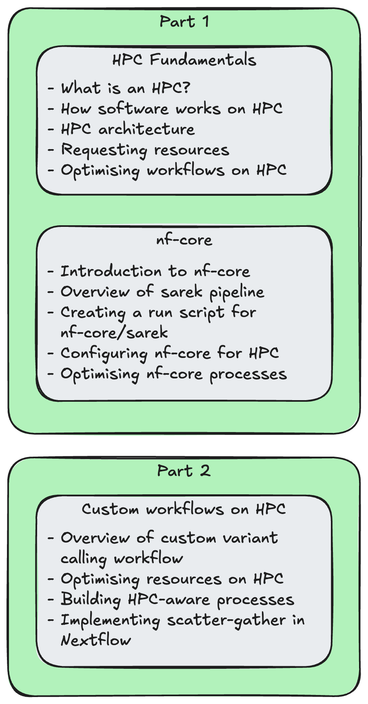

<<<<<<< HEAD
# 1.0 Part 1 Introduction

In the first part of this workshop, we will familarise ourselves with some foundational concepts required to effectively run bioinformatics workflows on HPC clusters. We will then apply these concepts to the configuration of a popular nf-core pipeline, Sarek. In part 2, we will further apply these concepts to a custom Nextflow workflow.
=======
# 1.0 Introduction

In the first part of this workshop, we will familarise ourselves with some foundational concepts required to effectively run bioinformatics workflows on HPC clusters. We will then apply these concepts to the configuration of a popular nf-core pipeline, Sarek. In part 2, we will further apply these concepts to a custom Nextflow workflow.

{width=50%}
>>>>>>> origin/main

!!! warning "Note the code blocks!"

    You’ll notice that many code examples in this workshop are presented in **tabs** for the different HPC systems we're using in this workshop.

    The commands provided are largely the same, but each system has its own scheduler, queues, and job submission syntax.

    Select the tab that matches the system you’re using, the content will stay synced across the page.

    If you switch to **Setonix** once, all other tabs on this page will automatically follow.


    === "Gadi (PBS)"
        If you've been assigned a training account on Gadi, your commands and configurations will be specific to the PBS Pro job scheduler running on Gadi.

        ```bash
        An example command to run on Gadi
        ```

    === "Setonix (Slurm)"
        If you've been assigned a training account on Setonix, your commands and configurations will be specific to the SLURM job scheduler running on Setonix.

        ```bash
        An example command to run on Setonix
        ```

!!! question "Let us know if you need help"

    HPCs are complex, shared systems, and this can sometimes introduce unexpected issues and errors. If you ran into any issues at any time during this workshop, please use the **":material-close:{ .close } No"** Zoom react and our facilitators can help you out. If necessary, we will make use of breakout rooms to diagnose significant issues and make sure that everyone is at the same point before moving on to further lessons.

    We will also provide a Google Docs document for questions you might have.

## 1.0.1 Log in to your assigned HPC

If you haven't already done so, follow the [setup instructions](../setup.md) to set up VSCode and log in to your assigned HPC with the user account and password provided to you.

!!! warning "Make sure you are logged in with your training account credentials!"

    If you have previously had an account on either Gadi or Setonix, it is possible that you may have those accounts set up in you SSH configuration file (by default this is `~/.ssh/config`, where `~` is your home directory). In this case, you might have duplicate entries for your HPC hostname, causing you to accidentally log in with those credentials rather than your provided training credentials.

    When you log in to your assigned account and access the terminal in VSCode (`Ctrl + J` (Windows/Linux) / `Cmd + J` (Mac)), you should see your username in the prompt:

    === "Gadi (PBS)"

        ```console
        [aaa000@gadi-login-01 ~]$
        ```

    === "Setonix (Slurm)"

        ```console
        cou001@setonix-01:~>
        ```

    If you see a different user name, close the window and try re-connecting to the HPC. If you find that you keep logging in to the wrong user account, you can also try editing your SSH config file and removing the old account details:

    === "Gadi (PBS)"

        ```title="Duplicate entries for gadi.nci.org.au in ~/.ssh/config"
        Host gadi.nci.org.au
            HostName gadi.nci.org.au
            User aaa000

        Host gadi.nci.org.au
            HostName gadi.nci.org.au
            User oldusername
        ```

    === "Setonix (Slurm)"

        ```title="Duplicate entries for setonix.pawsey.org.au in ~/.ssh/config"
        Host setonix.pawsey.org.au
            HostName setonix.pawsey.org.au
            User cou001

        Host setonix.pawsey.org.au
            HostName setonix.pawsey.org.au
            User oldusername
        ```

    If you see duplicate entires like this, delete the old entry and try logging in again.

<<<<<<< HEAD
=======
## 1.0.2 Setup the workspace

!!! warning "Skip this if the workspace has already been set up"

    This step will setup the workspace for the workshop. This includes:
    
    - Creating the directory `/scratch/<PROJECT>/<USER>/nextflow-on-hpc-materials`
    - Cloning the `sarek` git repository to `/scratch/<PROJECT>/<USER>/nextflow-on-hpc-materials/part1/sarek`
    - Cloning the `config-demo-nf` git repository to `/scratch/<PROJECT>/<USER>/nextflow-on-hpc-materials/part1/config-demo-nf`
    - Creating and populating the Singularity cache directory at `/scratch/<PROJECT>/<USER>/nextflow-on-hpc-materials/singularity`

    This is a **one-time setup**. **If these folders and files already exist** on your system, it means it has already been setup and you can **safely skip ahead to [section 1.0.3: Navigate to the `part1` working directory](#103-navigate-to-the-part1-working-directory)**.

    We will let you know on the day whether these steps have already been performed for you.

>>>>>>> origin/main
For this workshop, we will be working within the scratch storage system of the HPCs. Navigate to the scratch space for the workshop project.

1.  In the left-hand side bar, click on the "Explorer" tab (an icon that looks like two sheets of paper).

    

2.  Click on "Open Folder"

3.  In the text box that appears, enter the path of your assigned directory in the HPC scratch space:

    === "Gadi (PBS)"

        On Gadi, we will be working entirely within the scratch space for the `vp91` project: `/scratch/vp91/`. In this directory, everyone will have their own folder, labelled with the same name as their user ID. This is the path you should enter into the text box when prompted. For example, for the username `usr123`, you would enter:

        ```
        /scratch/vp91/usr123
        ```

    === "Setonix (Slurm)"

        On Setonix, we will be working entirely within the scratch space for the `courses01` project: `/scratch/courses01/`. In this directory, everyone will have their own folder, labelled with the same name as their user ID. This is the path you should enter into the text box when prompted. For example, for the username `usr123`, you would enter:

        ```
        /scratch/courses01/usr123
        ```

<<<<<<< HEAD
## 1.0.2 Setup the project space

When you first log in, your directory in the scratch space will be an empty folder. The first job for the day will be to clone the workshop materials into this space. To do this, open the VSCode terminal (`Ctrl + J`) and run the following commands:
=======
When you first log in, your directory in the scratch space will be an empty folder. The first job for the day will be to clone the workshop materials into this space. To do this, open the VSCode terminal (`Ctrl + J` (Windows/Linux) / `Cmd + J` (Mac)) and run the following commands:
>>>>>>> origin/main

```bash
git clone https://github.com/Sydney-Informatics-Hub/nextflow-on-hpc-materials.git
cd nextflow-on-hpc-materials
ls
```

You should see a few folders and files inside here:

```console title="Output"
README.md        part1/           setup.gadi.sh
data/            part2/           setup.setonix.sh
```

There are two scripts in the main directory: `setup.gadi.sh` and `setup.setonix.sh`, one for each HPC we are using in this workshop. These scripts set up the workspace and pull a few additional git repositories that we will be using throughout the workshop. Go ahead and run the relevant script for your system:

=== "Gadi (PBS)"

    ```bash
    ./setup.gadi.sh
    ```

=== "Setonix (Slurm)"

    ```bash
    ./setup.setonix.sh
    ```

Once completed, the script will print out "Setup complete" to confirm everything has successfully been set up.

!!! warning "Attention Gadi users: If you get this message..."
<<<<<<< HEAD

    On Gadi, you may get the following message at the end of the setup script:

    ```console
    IMPORTANT: YOUR DEFAULT PROJECT HAS BEEN CHANGED TO 'vp91'. PLEASE LOG OUT AND BACK IN AGAIN TO REFRESH YOUR SESSION.
    ```

    If you see this message, you will need to close your window and re-connect to the HPC [as per the setup instructions](../setup.md#connecting-to-the-hpcs).
=======
>>>>>>> origin/main

    On Gadi, you may get the following message at the end of the setup script:

    ```console
    IMPORTANT: YOUR DEFAULT PROJECT HAS BEEN CHANGED TO 'vp91'. PLEASE LOG OUT AND BACK IN AGAIN TO REFRESH YOUR SESSION.
    ```

    If you see this message, you will need to close your window and re-connect to the HPC [as per the setup instructions](../setup.md#connecting-to-the-hpcs).

## 1.0.3 Navigate to the `part1` working directory

As a final step, go to VSCode's "File" menu and select "Open Folder...". Enter the full path to the `part1` directory in the text box that appears at the top of the window:

=== "Gadi (PBS)"

    `/scratch/vp91/<username>/nextflow-on-hpc-materials/part1`

=== "Setonix (Slurm)"

    `/scratch/courses01/<username>/nextflow-on-hpc-materials/part1`

Press Enter and the window will refresh. Now the window is loaded at today's working directory, since everything we will be doing in part 1 of this workshop will be within this folder.

!!! question "Did everything work correctly?"

    The above setup steps are vital for the rest of the workshop. If you ran into any issues, please react with a **":material-close:{ .close } No"** and we can help out before we move on.

    Otherwise, if you're ready to move on, please let us know by reacting on zoom with a **":material-check:{ .check } Yes"**.

We are now ready to get started with the workshop!
