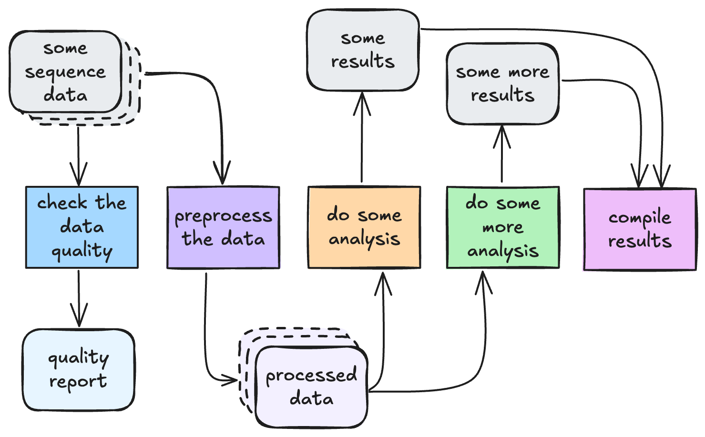
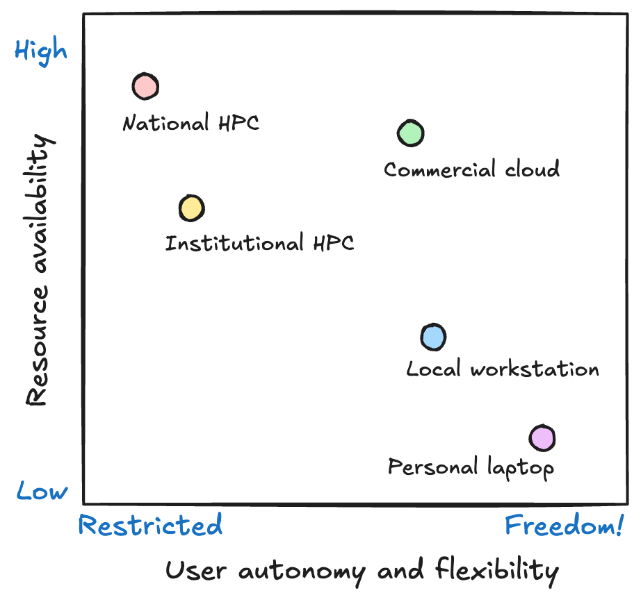
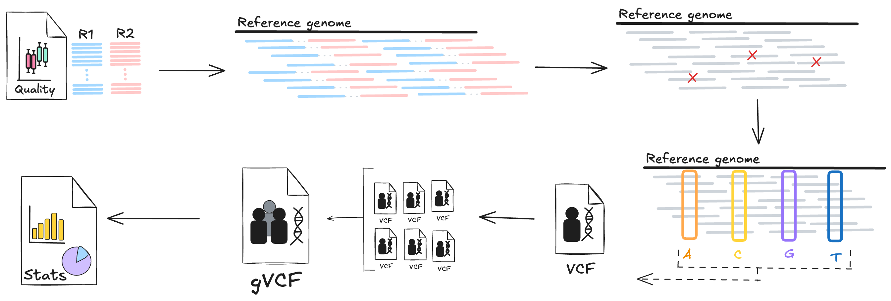

# 1.1 HPC for bioinformatics workflows

!!! info "Learning objectives"

    - Define high performance computing (HPC) and describe its main components
    - Explain when bioinformatics workflows require HPC resources rather than local execution
    - Summarise the main constraints imposed by HPC environments.

## 1.1.1 What is an HPC?

High Performance Computing (HPC) systems are large **clusters** of computers with lots of CPUs, memory (RAM) and storage space. They are specially-built to run large numbers of computational jobs efficiently and concurrently. Bioinformatics analysis often involves many steps, many tools, many samples, and large datasets, which can quickly overwhelm your average laptop or desktop computer. When this becomes the case, HPCs can be the perfect solution to scaling up your workflows and running them efficiently and quickly. However, HPCs expect work to be submitted in a particular way, following specific rules. This means our workflows often need to be designed for HPC, not just moved to HPC.

## 1.1.2 When does a workflow need HPC?

In bioinformatics, a workflow is simply a defined series of steps that take data as input and transform that data into processed data and/or analytical results. This is true whether you are doing whole genome variant calling, proteomics quantification, single-cell transcriptomics, or metagenomics assembly. Each step in the pipeline performs one job, and each job depends on some form of computation and storage.

### Signs your workflow is ready for HPC

Not every workflow needs a supercomputer. Many analyses start on a laptop and stay there — especially during method development, testing small datasets, or when turnaround is more important than throughput. HPC becomes necessary when your workflow starts to hit practical limits of time, memory, storage, reliability, or governance.

A workflow is usually ready for HPC when scale becomes a problem. This might be scale in data size (more gigabytes than your laptop can hold), compute time (weeks of serial runs), memory usage (jobs crash due to insufficient RAM), or workflow complexity (tens of jobs become too painful to run manually).

| Challenge                                         | Example scenario                                                                                        |
| ------------------------------------------------- | ------------------------------------------------------------------------------------------------------- |
| Runtime is too long                               | A single sample takes >12 hours to process                                                              |
| Data size is too big                              | Multiple large FASTQs need to be processed                                                              |
| Memory requirements are too large                 | R or Python crashes loading matrices                                                                    |
| Scaling samples manually is painful               | Manually running multiple scripts across multiple samples                                               |
| Storage is a bottleneck                           | Local disk is constantly full due to raw and processed data size                                        |
| Serial execution is too slow                      | Workflow is too slow to run one sample after another - multi-sample analysis must run faster            |
| Data governance, ethics, and security constraints | Legal and/or ethical requirements mean highly-protected data must stay on institutional, secure systems |

If any of the above scenarios sound familiar, then your workflow is likely ready to be moved to and configured for running on an HPC.

## 1.1.3 From your laptop to HPC

Before running a workflow, it is important to understand the system we are running it on. Running workloads on HPC is very different from running them on your laptop or a local workstation. HPCs are not just bigger, they are also:

- Shared
- Scheduled
- Resource constrained.

This introduces an important trade-off. HPCs give you access to massive computational power but at the cost of flexibility. On your laptop or a local workstation you can run whatever you like, whenever you like so long as it fits within the resource limitations of the system. On HPC, you gain scale and speed but you must work within system policies and limits.

{width=70%}

### Shared systems

HPCs are large-scale institutional computing clusters that are intended to be used by many users at once. Indeed, their size and available resources mean than dozens or even hundreds of users can be using them at the same time and still manage to run large scale workflows concurrently and in a timely manner. However, this shared nature puts a significant constraint on how they can be used.

The primary constraint is that you don't have the freedom to install whatever software you want on the system. This means that you need other solutions to running the tools that you want. We will explore this issue in the [next section](./01_2_hpc_software.md).

Another constraint is the file system. While HPCs typically have huge shared file systems, they are neither infinite in size nor speed. Running workflows that generate lots of files, or read and write to the file system too frequently, will degrade the performance of the system for all users. Therefore, we need to be conscious of what our workflow is doing and make sure we design it to use the system fairly and efficiently. We will discuss storage limitations in [1.3 HPC architecture](./01_3_hpc_architecture.md).

### Schedulers

On your local laptop, you will be used to running things whenever you like, but on shared systems like HPCs, this is not the case. Instead, HPCs require you to **submit** jobs to a **scheduler**, which decides where and when to run your job based on its resource requirements and the requirements of all other jobs in the **queue**. This makes HPCs **asynchronous** and **non-interactive**: job execution doesn't happen immediately and jobs won't necessarily execute in the order that they were submitted. As such, an HPC workflow needs to be designed to handle this delayed and potentially out-of-order execution style. As we will see later today, Nextflow is perfectly suited to writing workflows that work in this way.

### Resource constraints

Finally, HPCs may have large amounts of computing resources, but they aren't infinite, and they also need to be shared between many users. Therefore, it is vital when running jobs on an HPC to define exactly how many resources you require, including the number of CPUs you need, the amount of memory/RAM, and how much time your jobs needs. As you will see later in this workshop, it is very important to optimise these requests as best as you can, as under- and over-requesting resources can negatively impact your jobs.

## 1.1.4 Introducing our workshop scenario: WGS short variant calling

!!! warning "Don't worry if you don't have prior knowledge of this workflow"

    The focus of this workflow is on learning Nextflow; the experimental context we are using (WGS short variant calling) is just a practical example to help you understand workflow design principles for HPC and how Nextflow works. You are not expected to have prior knowledge of variant calling workflows or best practices.

For this workshop, we will be focussing on a common bioinformatics analysis workflow used in genomics to identify genetic variants (SNPs and indels) from short-read whole genome sequencing data. This workflow involves multiple processes and tools and is computationally intensive. At a high level, the general procedure is:

1. Quality control of raw sequences, e.g. filtering & trimming reads
2. Alignment of reads to a reference genome
3. Post alignment processing: sorting, marking duplicates, indexing
4. Variant calling: call SNVs and indels for each sample against reference
5. Joint genotyping: combining samples from a cohort into a single callset
6. Reporting

Running this workflow end-to-end captures many challenges that running on HPC using Nextflow can solve:

- Many independent jobs: each sample can be processed separately for many steps
- Resource diversity: tools used at each step require different amounts of CPU, memory, and walltime
- Large IO demands: reading and writing of multi-gigabyte files benefits from parallel filesystems

Throughout the workshop we will implement and explore different parts of this workflow in slightly different ways in order to highlight the lessons being taught.

!!! question "How does HPC help run this workflow?"

    Consider the workflow described above:

    1. How does each stage use computational resources? What is the limiting factor of each stage?
    2. What would happen if we tried to run this workflow on a personal computer?

    ??? note "Answer"

        Each stage of this workflow has different computational requirements, and many are quite intense:

        | Stage | Limiting factor | Explanation |
        | ----- | --------------- | ----------- |
        | QC | Storage - I/O speed | Low CPU & memory requirements, but needs fast access to large files |
        | Alignment | CPU | CPU speed determines how quickly reads can be aligned. Memory requirements are variable: reads can be aligned independently, can read in data in small chunks. |
        | Post-alignment processing | CPU + memory | Both CPU and memory requirements are high as many reads need to be processed together |
        | Variant calling | CPU + memory | CPU usage is high as lots of calculations need to be performed to determine how likely a variant is at each genomic position. All reads within a given region must be processed together, so memory use is also high. |
        | Joint genotyping | CPU + memory | Need to read data from all samples into memory at once, so memory usage is high. CPU also high to make final variant calls for entire cohort. |
        | Reporting | Storage - I/O speed | Low CPU & memory requirements as we only need to summarise the dataset. Fast access to large files creates storage bottleneck. |

        On a standard laptop, this workflow would not get very far before failing due to running out of memory during the alignment or variant calling phases. Designing this workflow for HPC lets us take advantage of large numbers of CPUs, lots of memory, and parallel execution of tasks to considerably speed up each stage.

Short variant calling is just one example of where HPCs can be utilised to more efficiently process bioinformatics data. Many bioinformatics workflows, such as RNA sequencing and proteomics data analysis, involve similarly large datasets whose analysis is computationally expensive yet often parallelisable. If you find that your workflows are starting to struggle on your laptop, or you find that it is difficult to scale up your workflows to multiple samples and larger datasets, then this is a good sign that they need to be moved to an HPC and possibly re-designed to take advantage of parallel computation.