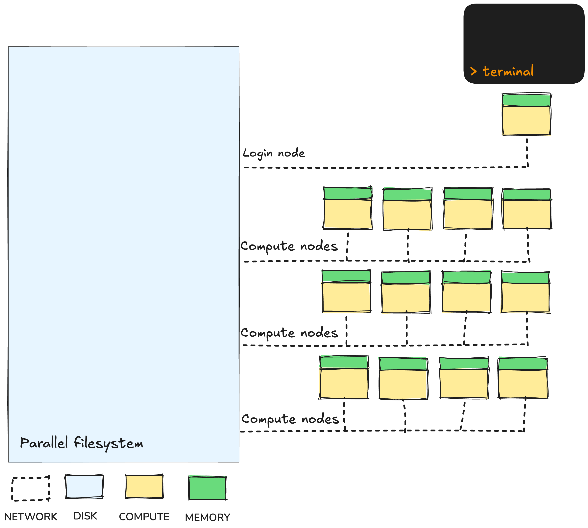

# 1.3 HPC architecture

!!! info "Learning objectives"

    - Describe the HPC system components that workflows interact with
    - Describe the roles of login nodes, compute nodes, and shared storage in HPC systems
    - Distinguish between login nodes and compute nodes and know where workflows execute
    - Explain how shared filesystems are accessed and managed safely in workflows
    - Define job resource requirements (CPU, memory, walltime) and their impact on scheduling

## 1.3.1 Typical HPC architecture

While HPCs can look intimidating, their architecture follows a simple structure that supports large-scale computation through shared resources. From a workflow perspective, this architecture means there are a few important realities to accept: work is not run interactively, resources must be requested rather than assumed and everything is governed by shared access.



### Login nodes

When a user connects to an HPC, they first land on a **login node**. This is a shared access point used to prepare work, not perform computations. From here, users submit jobs to the scheduler, monitor their progress and organise their project directories. The login node exists only to coordinate access to the system, and because it is shared by many people at once, it must not be overloaded with computational tasks.

### Compute nodes

The real work happens on the compute nodes. These are powerful machines with many CPU cores, large amounts of memory and fast access to storage. When you run a workflow, the scheduler assigns the individual tasks of the workflow to available compute nodes based on the resources requested. This separation between the login node and compute nodes allows users to interact with the system while computation is queued and executed elsewhere.

### Queues

HPC systems divide compute resources into queues (also called "partitions" in Slurm). Each queue represents a group of compute nodes with specific hardware characteristics, limits, and intended usage.

Queues help balance the system between different types of work, for example, short interactive tasks, long-running simulations, or large parallel jobs. Each queue enforces policies on maximum runtime (walltime), maximum cores or memory per job, job priority and eligible users or projects.

Because queues are mapped to distinct sets of compute nodes, requesting the right queue for your job is important for both performance and fairness.

Queue names and limits differ across infrastructure providers but some common examples include:

| Queue type        | Description                             | Typical limits                                           |
| ----------------- | --------------------------------------- | -------------------------------------------------------- |
| Normal/work       | Default queue for most batch jobs       | Moderate walltime (e.g. 24–48 h), general-purpose CPUs   |
| Express/short     | Prioritised for rapid turnaround        | Small jobs, short walltime                               |
| Large/high memory | For jobs requiring many CPUs or nodes   | Long walltime, higher resource requests                  |
| Copy              | For copying data to and from the system | Low CPU and RAM availability, moderate walltime (10-48h) |
| GPU               | Access to GPU-enabled nodes             | GPU-specific workloads only                              |

For details about queue limits and scheduling policies on systems used today, see:

- [Setonix (Slurm) – Running Jobs on Setonix (Pawsey)](https://pawsey.atlassian.net/wiki/spaces/US/pages/51929058/Running+Jobs+on+Setonix)
- [Gadi (PBS Pro) – Queue Limits (NCI)](https://opus.nci.org.au/spaces/Help/pages/236881198/Queue+Limits)

#### Internet access on compute nodes

Often, a workflow may need access to resources on the internet, such as Singularity container images and large reference databases. This can become an issue on HPCs, as some systems restrict internet access on the compute nodes. While on Setonix, all compute nodes are given internet access and can be used for downloading such resources, on Gadi, most of the compute nodes are kept offline; instead, only the compute nodes that make up the `copyq` queue are allowed to access the internet. Furthermore, this queue has a few important constraints, primarily that it only allows single CPU jobs and a maximum walltime of 10 hours. As such, when designing your workflows, you need to make sure you are working within these constraints.

As a general rule of thumb, it is always best to have as much as possible of your workflow's input data pre-downloaded, as in any case, downloading data from the internet can be a major bottleneck. Where possible, running your workflow 'offline' is best practice.

!!! warning "Mind your Qs"

    Make sure you are using the right queue for the right job! Requesting the wrong queue can lead to long wait times due to other jobs getting higher priority, or to failures or outright rejection from the scheduler due to invalid resource requests. Always **consult the documentation** specific to your system before designing, configuring, and running your workflow.

    Later on in this workshop, we will see some simple examples of how we can **dynamically** request the queue for Nextflow processes based on the resources they require.

Remember to **always consult the documentation** specific to your HPC before writing and running workflows!

### Shared storage

All nodes are connected to a shared parallel filesystem. This is a large, high-speed storage system where input data, reference files and workflow outputs are kept. Because it is shared across all users, it enables collaborative research and scalable workflows. However, it also introduces constraints around file organisation and performance, which is why workflows must be careful about how they read and write data here.

!!! warning "Overwriting Files in Shared Filesystems"

    Because the filesystem is shared, multiple jobs or users writing to the same file, especially if it has a common name, can accidentally overwrite each other’s data or cause [race conditions](https://en.wikipedia.org/wiki/Race_condition).

    Most tools and scripts write to files in a way that replaces the entire file. On shared systems like /scratch, where many users and jobs access the same space, this can lead to conflicts or data loss.

    It’s good practice to:

    - Use unique filenames (e.g., include job ID or timestamp).
    - Avoid simultaneous writes unless explicitly managed.
    - Add file checks and error handling.

### The job scheduler

At the centre of everything is the job scheduler. Rather than allowing users to run programs directly, HPCs rely on a scheduling system (e.g. Slurm or PBS Pro) to manage fair access to shared compute resources. When a job is submitted, it enters a queue where the scheduler decides when and where it will run. Jobs are matched to compute nodes based on requested resources like CPU, memory and runtime.

Schedulers like PBS Pro and Slurm use queues to group jobs that share similar resource and policy constraints. When you submit a job, it’s placed in the appropriate queue, and the scheduler continuously evaluates all queued jobs to decide which can start next.

Each job’s shape is determined by three key factors:

- **CPU**: how many processor cores it needs
- **Memory**: how much RAM it requires
- **Walltime**: how long it is allowed to run

Once submitted, your job enters a **queue**. Unlike a simple first-come-first-served queue, the scheduler constantly reshuffles and fits jobs together to maximise system usage.

The order in which jobs run depends on several factors:

- **Job priority**: determined by project, queue, and fair-share usage
- **Requested resources**: smaller jobs can often “slot in” sooner
- **Queue limits**: different queues prioritise short, long, or interactive jobs

Getting the shape right matters. Underestimating the resources you job requires will cause it to fail. What is less immediately obvious is that overestimating your needs is also detrimental, as it makes your job harder to fit. Common outcomes from overestimating your job's requirements include:

- **Longer queue times**: large, awkwardly-shaped jobs wait for space
- **Wasted capacity**: unused cores or memory that could have run other jobs
- **Wasted money**: HPC providers will charge you for the CPUs and memory you request. **Wasted capacity = wasted energy!**

!!! note "Understanding Job Scheduling with Tetris"

    Think of the scheduler like a giant game of Tetris, where every job you submit has its own unique “shape.”
    When you submit a batch job, you describe the resources it needs, this defines the shape of your job piece.
    The scheduler’s task is to fit all these different pieces together as efficiently as possible across the available compute nodes.

    

    Just like in Tetris, the scheduler aims to fill every gap and keep the system running smoothly.
    Small, well-shaped jobs often fall neatly into open spaces, while larger ones wait for the perfect fit.

## 1.3.2 Submitting scripts to the scheduler

To familiarise ourselves with submitting jobs to the scheduler, we will once again use `fastqc` as an example. We have an example script for running `fastqc` in the `scripts/` directory:

=== "Gadi (PBSpro)"

    ```bash title="scripts/fastqc.pbs.sh"
    #!/bin/bash

    module load singularity

    SAMPLE_ID="NA12878_chr20-22"
    READS_1="../data/fqs/${SAMPLE_ID}.R1.fq.gz"
    READS_2="../data/fqs/${SAMPLE_ID}.R2.fq.gz"

    mkdir -p "results/fastqc_${SAMPLE_ID}_logs"
    singularity exec ../singularity/quay.io-biocontainers-fastqc-0.12.1--hdfd78af_0.img \
    fastqc \
        --outdir "results/fastqc_${SAMPLE_ID}_logs" \
        --format fastq ${READS_1} ${READS_2}
    ```

=== "Setonix (Slurm)"

    ```bash title="scripts/fastqc.slurm.sh"
    #!/bin/bash

    module load singularity/4.1.0-slurm

    SAMPLE_ID="NA12878_chr20-22"
    READS_1="../data/fqs/${SAMPLE_ID}.R1.fq.gz"
    READS_2="../data/fqs/${SAMPLE_ID}.R2.fq.gz"

    mkdir -p "results/fastqc_${SAMPLE_ID}_logs"
    singularity exec ../singularity/quay.io-biocontainers-fastqc-0.12.1--hdfd78af_0.img \
    fastqc \
        --outdir "results/fastqc_${SAMPLE_ID}_logs" \
        --format fastq ${READS_1} ${READS_2}
    ```

The script does a few things:

1. It loads the `singularity` module. We'll need this to run the `fastqc` command when the job gets submitted to the compute node
2. It defines a few bash variables that point to the input FASTQ data
3. It creates an output directory called `results/fastqc_${SAMPLE_ID}_logs/`, where `${SAMPLE_ID}` will get evaluated to `NA12878_chr20-22`
4. It runs the `fastqc` command within a singularity container by prefixing the command with `singularity exec ../singularity/quay.io-biocontainers-fastqc-0.12.1--hdfd78af_0.img`.

!!! note "Your container is ready to go!"
For the sake of expediency, we have pre-downloaded the `fastqc` singularity container image for you at `../singularity/quay.io-biocontainers-fastqc-0.12.1--hdfd78af_0.img`.

This is everything we need to run the job; we just have to submit the script to the HPC scheduler. In doing so, we will provide the following details to the scheduler:

- Project name: This is the HPC project that we want to run our job under, used to determine which filesystems we have access to and what project to bill to.
- Job name: A name to give our job, to help distinguish it from others we or other people may be running; we will call our job `fastqc`
- Queue: Which compute queue to submit our job to. Different queues have different resource limits. We will use the standard node for our HPCs.
- Number of nodes and/or CPUs: A job can request differing numbers of nodes and CPUs it requires to run; we will just request 1 CPU on 1 node.
- Amount of memory: The amount of RAM that our job requires to run; we will request 1 gigabyte.
- Walltime: The time our job needs to complete; we will request 1 minute.

!!! example "Exercise: Submitting the fastqc script to the HPC"

    In the **VSCode terminal** (`Ctrl + J` (Windows/Linux) / `Cmd + J` (Mac)), type in the following code. **Note the backslashes (`\`)**: these indicate that you will continue the command on the next line. When you type a backslash and press `Enter`, you will get a `>` character in your terminal prompt, indicating that you can continue writing your command here. **Ensure you put a space before the backslashes**.

    === "Gadi (PBSpro)"

        ```bash
        qsub \
            -P $PROJECT \
            -N fastqc \
            -q normalbw \
            -l ncpus=1 \
            -l mem=1GB \
            -l walltime=00:01:00 \
            -l storage=scratch/$PROJECT \
            -l wd \
            scripts/fastqc.pbs.sh
        ```

        Let's deconstruct this command:

        - `-P $PROJECT`: This specifies the project using the environment variable `$PROJECT`, which is pre-defined with your default NCI project ID.
        - `-N fastqc`: This specifies the job name as `fastqc`.
        - `-q normalbw`: This specifies the queue as `normalbw`; this is a general queue on NCI for regular jobs that don't need any special resources.
        - `-l key=value`: The `-l` parameter lets us specify resources that we require in a `key=value` format:
            - `-l ncpus=1`: This specifies that we want 1 CPU to run our job.
            - `-l mem=1GB`: Here we request 1 GB of memory.
            - `-l walltime=00:01:00`: This requests 1 minute of walltime; walltime is specified in the format `HH:MM:SS`
            - `-l storage=scratch/$PROJECT`: This tells Gadi to mount the scratch space for our project; this is not done by default, so we always need to specify it.
            - `-l wd`: This tells Gadi to run the job in the current **w**orking **d**irectory.

    === "Setonix (Slurm)"

        ```bash
        sbatch \
            --account=$PAWSEY_PROJECT \
            --job-name=fastqc \
            --partition=work \
            --nodes=1 \
            --ntasks=1 \
            --cpus-per-task=1 \
            --mem=1GB \
            --time=00:01:00 \
            scripts/fastqc.slurm.sh
        ```

        Let's deconstruct this command:

        - `--account=$PAWSEY_PROJECT`: This specifies the project using the environment variable `$PAWSEY_PROJECT`, which is pre-defined with your default Pawsey project ID.
        - `--job-name=fastqc`: This specifies the job name as `fastqc`.
        - `--partition=work`: This specifies the queue (also called "partitions" on Setonix) as `work`; this is a general queue on Pawsey for regular jobs that don't need any special resources.
        - `--nodes=1 --ntasks=1 --cpus-per-task=1`: This specifies that we want 1 CPU on 1 node to run our job.
        - `--mem=1GB`: Here we request 1 GB of memory.
        - `--time=00:01:00`: This requests 1 minute of walltime; walltime is specified in the format `HH:MM:SS`

    Once you have written out the command, ensure you have **no final backslash**, and press `Enter` to submit the script to the scheduler.

    Once submitted, you can monitor the progress of your job with the following command:

    === "Gadi (PBSpro)"

        ```bash
        qstat -u ${USER}
        ```

    === "Setonix (Slurm)"

        ```bash
        squeue -u ${USER}
        ```

    This will output a list of all running jobs and their status:

    === "Gadi (PBSpro)"

        ```console title="Output"
        gadi-pbs:
                                                                        Req'd  Req'd   Elap
        Job ID               Username Queue    Jobname    SessID NDS TSK Memory Time  S Time
        -------------------- -------- -------- ---------- ------ --- --- ------ ----- - -----
        123456789.gadi-pbs   usr123   normal   fastqc        --    1   1  1024m 00:10 Q   --
        ```

        The `S` column near the end shows the status of the job, with typical codes being `Q` for queued, `R` for running, and `E` for finished or ending jobs.

    === "Setonix (Slurm)"

        ```console title="Output"
        JOBID        USER ACCOUNT                   NAME   EXEC_HOST ST     REASON START_TIME       END_TIME  TIME_LEFT NODES   PRIORITY       QOS
        12345678 username pawsey1234                fastqc       n/a PD       None N/A                   N/A      10:00     1      75423    normal
        ```

        The `ST` column near the middle shows the status of the job, with typical codes being `PD` for pending or queued, `R` for running, and `CG` for finished jobs.

    Once complete, you should see a `results/` folder; inside, there should be a sub-folder called `fastqc_NA12878_chr20-22_logs` containing several `.zip` and `.html` files - the output results and reports from `fastqc`:

    ```bash
    ls results/fastqc_NA12878_chr20-22_logs/
    ```

    ```console title="Output"
    NA12878_chr20-22.R1_fastqc.html NA12878_chr20-22.R2_fastqc.html
    NA12878_chr20-22.R1_fastqc.zip  NA12878_chr20-22.R2_fastqc.zip
    ```

    Before moving on, delete the `results/` directory:

    ```bash
    rm -r results
    ```

## 1.3.3 Cleaning up job submission

The above command is quite long, and would be a pain to write out every time you want to submit a script, especially if you want to run the same script several times with different samples. Luckily, there is a better way of specifying the resources required by a script. Both PBS Pro and Slurm support using special comments at the top of the script file itself for specifying the resources it requires.

!!! example "Exercise: A cleaner job submission"

    A good practice is to specify as many of the scheduler parameters within the header of the script itself as special comments. Note, however, that only static - i.e. unchanging - parameters can use this feature; if you need to dynamically assign resources to jobs, you will still need to use the commandline parameters.

    === "Gadi (PBSpro)"

        Update the `scripts/fastqc.pbs.sh` script with the following header comments:


        ```bash title="scripts/fastqc.pbs.sh" hl_lines="2-9"
        #!/bin/bash
        #PBS -P vp91
        #PBS -N fastqc
        #PBS -q normalbw
        #PBS -l ncpus=1
        #PBS -l mem=1GB
        #PBS -l walltime=00:01:00
        #PBS -l storage=scratch/vp91
        #PBS -l wd

        module load singularity

        SAMPLE_ID="NA12878_chr20-22"
        READS_1="../data/fqs/${SAMPLE_ID}.R1.fq.gz"
        READS_2="../data/fqs/${SAMPLE_ID}.R2.fq.gz"

        mkdir -p "results/fastqc_${SAMPLE_ID}_logs"
        singularity exec ../singularity/quay.io-biocontainers-fastqc-0.12.1--hdfd78af_0.img \
        fastqc \
            --outdir "results/fastqc_${SAMPLE_ID}_logs" \
            --format fastq ${READS_1} ${READS_2}
        ```

        Note how we need to explicitly state the project name for both the `-P` and `-l storage` parameters.

    === "Setonix (Slurm)"

        Update the `scripts/fastqc.slurm.sh` script with the following header comments:

        ```bash title="scripts/fastqc.slurm.sh" hl_lines="2-9"
        #!/bin/bash
        #SBATCH --account=courses01
        #SBATCH --job-name=fastqc
        #SBATCH --partition=work
        #SBATCH --nodes=1
        #SBATCH --ntasks=1
        #SBATCH --cpus-per-task=1
        #SBATCH --mem=1GB
        #SBATCH --time=00:01:00

        module load singularity/4.1.0-slurm

        SAMPLE_ID="NA12878_chr20-22"
        READS_1="../data/fqs/${SAMPLE_ID}.R1.fq.gz"
        READS_2="../data/fqs/${SAMPLE_ID}.R2.fq.gz"

        mkdir -p "results/fastqc_${SAMPLE_ID}_logs"
        singularity exec ../singularity/quay.io-biocontainers-fastqc-0.12.1--hdfd78af_0.img \
        fastqc \
            --outdir "results/fastqc_${SAMPLE_ID}_logs" \
            --format fastq ${READS_1} ${READS_2}
        ```

        Note how we need to explicity state the project name for the `--account` parameter.

    With the script updated, you can simply run your HPC submission command without any of the previously supplied parameters. We will also redirect the output of the submission command (which prints a message containing the job ID) to a file called `run_id.txt` for use in the next lesson.

    === "Gadi (PBSpro)"

        ```bash
        qsub scripts/fastqc.pbs.sh > run_id.txt
        ```

    === "Setonix (Slurm)"

        ```bash
        sbatch scripts/fastqc.slurm.sh > run_id.txt
        ```

    The job can be monitored the same way as before, and once complete, should produce the exact same output:

    ```bash
    ls results/fastqc_NA12878_chr20-22_logs/
    ```

    ```console title="Output"
    NA12878_chr20-22.R1_fastqc.html NA12878_chr20-22.R2_fastqc.html
    NA12878_chr20-22.R1_fastqc.zip  NA12878_chr20-22.R2_fastqc.zip
    ```

!!! question "How are you going?"

    If you're following along so far, let us know by reacting on zoom with a **":material-check:{ .check } Yes"**.

    If you're running into any issues, please react with a **":material-close:{ .close } No"** and we can help out before we move on to the next section.
