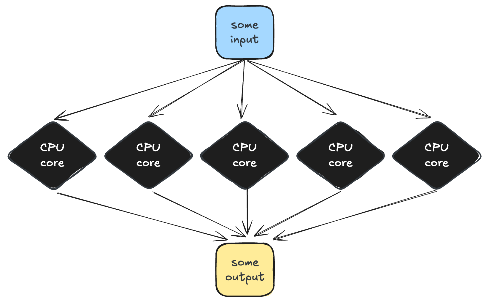

# 1.2 Work smarter, not harder  

!!! info "Learning objectives"

    - blah 
    - blah 
    
- Parallelism, threads, memory usage per process
- Right-size your resources (avoid over-allocation)
- Scatter/gather vs multithreading
- **Key takeaway:** Efficiency determines queue time AND cost.

HPC systems give us access to large amounts of compute, but that doesn’t mean we should use resources carelessly. Misusing compute leads to long queue times, wasted allocation, unstable workflows and unhappy HPC administrators. Designing resource-aware workflows is essential for performance and fair use.

At its core, HPC efficiency is about matching the structure of your workflow to the available compute. There are two main ways to increase performance on HPC:

### Parallelisation: multithreading 

### Parallelisation: scatter-gather 

