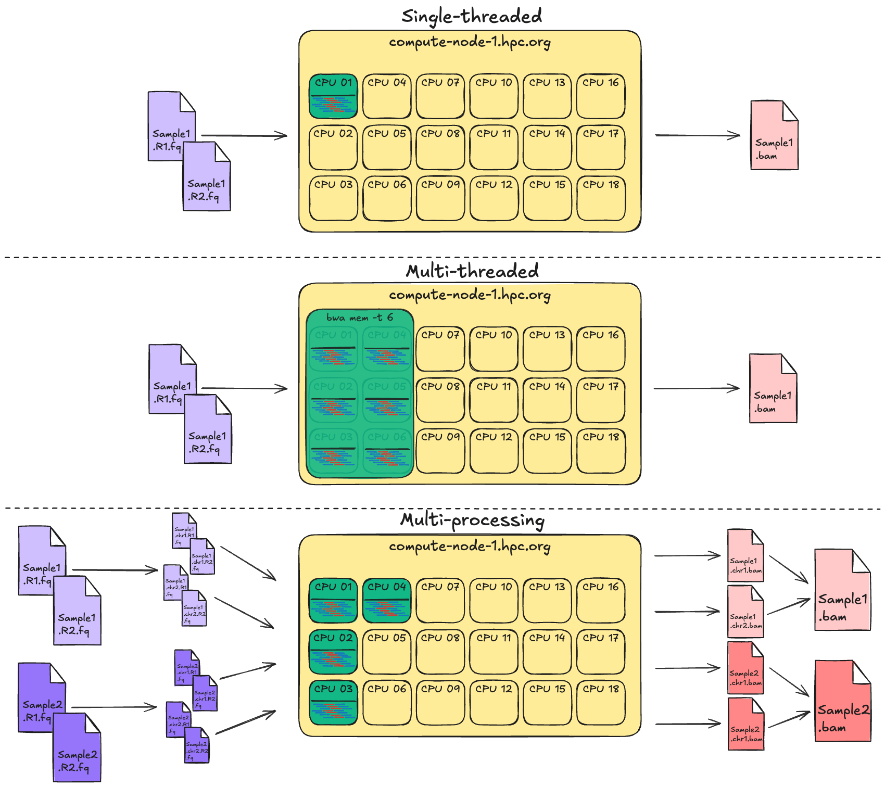

# 1.4 Work smarter, not harder!

!!! info "Learning objectives"

    - Understand how HPC resources affect job scheduling and performance
    - Describe how HPC scheduling and resource limitations shape pipeline configuration.
    - Differentiate between multithreading and scatter–gather approaches to parallelisation
    - Identify how to size resource requests appropriately for each process in a workflow
    - Apply resource-aware design principles to improve job efficiency and reproducibility

HPC systems give us access to large amounts of compute, but that doesn’t mean we should use resources carelessly. Misusing compute leads to long queue times, wasted allocation, unstable workflows and unhappy HPC administrators. Designing resource-aware workflows is essential for performance and fair use.

## 1.4.1 Know thyself: tracking resource usage of your jobs

HPC systems are constantly measuring your resource usage. You can use their built in tools to measure actual use. The tools available to you will depend on the job scheduler and the administrator's implementation of the scheduler.

!!! example "Exercise: Inspect a previous job"

    At the end of the previous lesson, we saved the job ID to a file called `run_id.txt`. We can use that ID to inspect the resources used by the job:

    === "Gadi (PBSpro)"

        ```bash
        JOBID=$(cat run_id.txt)
        qstat -xf ${JOBID} | grep -E "Resource_List|resources_used"
        ```

        This will generate an output something like:

        ```console title="Output"
        resources_used.cpupercent = 50
        resources_used.cput = 00:00:04
        resources_used.jobfs = 0b
        resources_used.mem = 451276kb
        resources_used.ncpus = 1
        resources_used.vmem = 451276kb
        resources_used.walltime = 00:00:08
        Resource_List.jobfs = 104857600b
        Resource_List.mem = 1073741824b
        Resource_List.mpiprocs = 1
        Resource_List.ncpus = 1
        Resource_List.nodect = 1
        Resource_List.place = free
        Resource_List.select = 1:ncpus=1:mpiprocs=1:mem=1073741824:job_tags=normalb
        Resource_List.storage = scratch/vp91
        Resource_List.walltime = 00:01:00
        Resource_List.wd = 1
        ```

        We can see that in this example run, CPU usage was at 50%. Since we only requested 1 CPU, there is no more room for improvement here. We can also see that 451,276 KB (= 440.7 MB) of memory was used, while we requested 1 GB (= 1024 MB), giving us a memory efficiency of ~43%.

        Handily, Gadi also produces a summary of the resource usage at the end of its standard output stream. After each of the submitted jobs completed, you should have found two new files present in your working directory, called `fastqc.o<JOBNUM>` and `fastqc.e<JOBNUM>`, which are the standard output and standard error streams generated by the job. `<JOBNUM>` in this case is the numeric part of the job ID; e.g. if the job ID was 12345.gadi-pbs, the standard output file would be `fastqc.o12345`. The final 12 lines of the `fastqc.o<JOBNUM>` file will contain the resource summary:

        ```bash
        JOBNUM=$(echo ${JOBID} | sed -E -e 's/\.gadi\-pbs$//g')
        tail -n 12 fastqc.o${JOBNUM}
        ```

        ```console title="Output"
        ======================================================================================
                        Resource Usage on 2025-11-07 14:42:47:
        Job Id:             154138075.gadi-pbs
        Project:            vp91
        Exit Status:        0
        Service Units:      0.00
        NCPUs Requested:    1                      NCPUs Used: 1
                                                CPU Time Used: 00:00:04
        Memory Requested:   1.0GB                 Memory Used: 440.7MB
        Walltime requested: 00:01:00            Walltime Used: 00:00:08
        JobFS requested:    100.0MB                JobFS used: 0B
        ======================================================================================
        ```

        Again, we see that 440.7 MB was used out of the total requested 1 GB.

    === "Setonix (Slurm)"

        ```bash
        JOBID=$(sed -E -e 's/^Submitted batch job //g' run_id.txt)
        sacct -j ${JOBID} --format=JobID,JobName,Elapsed,State,AllocCPUS,TotalCPU,MaxRSS
        seff ${JOBID}
        ```

        This will generate an output something like:

        ```console title="Output"
        JobID           JobName    Elapsed      State  AllocCPUS   TotalCPU     MaxRSS
        ------------ ---------- ---------- ---------- ---------- ---------- ----------
        34324060         fastqc   00:00:17  COMPLETED          2  00:07.945
        34324060.ba+      batch   00:00:17  COMPLETED          2  00:07.942    376996K
        34324060.ex+     extern   00:00:17  COMPLETED          2  00:00.003          0

        Job ID: 34324060
        Cluster: setonix
        User/Group: username/username
        State: COMPLETED (exit code 0)
        Nodes: 1
        Cores per node: 2
        CPU Utilized: 00:00:08
        CPU Efficiency: 23.53% of 00:00:34 core-walltime
        Job Wall-clock time: 00:00:17
        Memory Utilized: 368.16 MB
        Memory Efficiency: 35.95% of 1.00 GB (1.00 GB/node)
        ```

        We can see that in this example run, CPU usage was at 23.53%. Since we only requested 1 CPU, there is no more room for improvement here. We can also see that the memory efficiency was ~36%, using ~368 MB of the requested 1 GB.

    Before moving on, delete the `results/` directory, as well as the scheduler outputs.

    === "Gadi (PBSpro)"

        ```bash
        rm -r results fastqc.*
        ```

    === "Setonix (Slurm)"

        ```bash
        rm -r results slurm-*
        ```

## 1.4.2 Resource awareness: right sizing

At its core, HPC efficiency is about matching the structure of your workflow to the available compute. It is therefore beneficial to be "resource aware" in your approach to running jobs. This involves understanding how much time, CPU, and memory each tool in your workflow actually needs and requesting enough.

Here we focus on 3 metrics:

- Elapsed time: the total walltime for the job
- CPU time: how much CPU time was actually used
- Maximum memory (RAM): the peak memory footprint of the job

In the context of running a workflow made up of multiple steps, each running a different tool, we consider each step separately in optimising for efficiency.

Let's look again at our workflow:

{width=80%}

As we touched on in [HPC for workflows](./01_1_hpc_for_workflows.md#114-introducing-our-workshop-scenario-wgs-short-variant-calling), each stage of this workflow has differeing resource requirements and bottlenecks:

| Step                | Dominant resource | Characteristics                      |
| ------------------- | ----------------- | ------------------------------------ |
| **Quality control** | I/O-bound         | Reads many files; CPU idle time high |
| **Read alignment**  | CPU-bound         | CPU pegged near 100%; memory stable  |
| **Variant calling** | CPU + memory      | CPU ~90%, high steady memory usage   |

We will observe these constraints in subsequent lessons when we run and optimise our workflows.

!!! note "Where can I find this information?"

    Most mature bioinformatics tools document their approximate resource usage. Keep in mind, documentation will not reflect the reality of your specific dataset and environment. Look at your own resource usage and scaling behaviour to test this.

    It's also very helpful to have small-scale datasets to initially test your workflows with. Common practices are to subset FASTQs to a small fraction of the reads, and to subset aligned data to the smaller chromosomes (e.g. chr22 in human data). This will help you quickly (and cheaply!) determine how your workflow behaves at each step and how it will scale with larger datasets.

    The more you practice tuning processes for efficiency, the faster you'll develop an intuition for scaling.

### CPU efficiency

CPU efficiency refers to how well the CPUs requested for the job are being utilised. It is commonly expressed as a percentage or as a range from 0-1. It is calculated as:

```
CPU time / walltime / number of CPUs
```

Where:

- CPU time is the **cumulative** time that all CPUs were actively working; and
- Walltime is the real-world time that the job took to run: i.e. the time as measured by a clock on the wall

Values near 1 mean your job used all the CPUs efficiently. Values much lower than 1 mean that the CPUs were sitting idle for a lot of the time; this can be because the job was waiting on I/O, or otherwise you may have over-allocated CPUs to your job.

As an example, suppose you requested 4 CPUs for a job which ran for 1 hour (walltime). If each CPU was utilised for 100% of the time, then CPU time would be **4 hours** and CPU efficiency would be:

!!! note ""
4 hours CPU time / 1 hour walltime / 4 CPUs = 100%

On the other hand, if the job actually only used 1 of those CPUs for that entire hour, then CPU time would only be 1 hour and CPU efficiency would be:

!!! note ""
1 hour CPU time / 1 hour walltime / 4 CPUS = 25%

### Memory (RAM) efficiency

Memory efficiency describes how much of your allocated memory was truly needed. If your job used close to the requested memory, you're right sized. On the other hand, if the maximum memory used by the job is much lower than requested, then you over-allocated. Your job will fail if maximum memory exceeds the requested allocation.

Note that it is a good idea to **slightly** over-request memory, since it is quite difficult to accurately predict exactly how much memory your job will need, and if you don't have enough of a buffer, you may find that slight fluctuations in the required memory will cause some jobs to fail. From a cost perspective, it is better to pay slightly more for a little more memory than pay twice to re-run a failed job.

### Walltime awareness

As mentioned above, walltime is the real-world time it takes for your job to run from start to finish. Schedulers use this value to plan future jobs being run by yourself and others. Overestimating walltime will keep you job in the queue for longer as it will have to wait for a suitable time slot to run. However, if you underestimate walltime, the job will be killed mid-run. As such, like memory, it is usually a good idea to **slightly** over-request walltime, esepcially since you are usually only charged for **actual walltime used**.

## 1.4.3 Optimising your jobs for efficiency

Once you understand how your workflow uses resources, you can start to optimise it. Optimisation is about balancing speed, efficiency, and fair use of the system.

In bioinformatics workflows, there are 2 main strategies used for increasing efficiency and throughput:

| Level                | Definition                                                                                                                             | Where it runs              | Memory model                | Example                                             |
| -------------------- | -------------------------------------------------------------------------------------------------------------------------------------- | -------------------------- | --------------------------- | --------------------------------------------------- |
| **Multi-threading**  | Multiple threads share memory space inside a single process. Threads cooperate to perform a single task faster.                        | One node                   | Shared memory               | Using the `-t` or `--threads` flag on a tool        |
| **Multi-processing** | Multiple independent processes run in parallel, each with its own memory space. Often managed by a workflow engine or batch scheduler. | One node or multiple nodes | Separate memory per process | Running `fastqc` on multiple samples simultaneously |



We can explore parallelisation methods of multi-threading and multi-processing in the context of our variant calling workflow and some small dummy data.

!!! warning "Beware of the overheads"

    While parallelism can be a great way to speed up your data processing, it doesn't always make things run faster. Splitting your jobs should only be done where it makes practical sense to do so. Keep in mind, the more you split your work up, the more issues you will have to contend with:

    - More job scheduling, more file-handling, more merging
    - Increased memory footprint and I/O for each sub-job
    - Diminishing returns when the time saved is offset by coordination cost

    See [this great explainer](https://gatk.broadinstitute.org/hc/en-us/articles/360035532012-Parallelism-Multithreading-Scatter-Gather) of parallelism from the GATK team.

### Parallelisation: multi-threading

!!! note "What is multi-threading?"

    Multithreading means one program is using multiple cores on the same node to complete a single task faster. Our ability to do this is dependent on the tool being used. Some bioinformatics tools support multithreading via a flag like `--threads` or `-t`.

In our variant calling workflow, some tools work best when given multiple cores on the same node, e.g. alignment with `bwa mem`. When you run:

```
bwa mem -t 4 ref.fasta sample_R1.fq.gz sample_R2.fq.gz > alignment.sam
```

You're telling BWA to use 4 worker threads for parts of the alignment process that can be parallelised. Not all parts of the process can be parallelised.

Be aware: not all tools can make use of threads effectively, and some are entirely single-threaded. This can stem from biological reasons, i.e. the computational problem simply needs to be run in a sequential manner. In other cases, the tool itself may simply not implement the `--threads` flag effectively.

For example, the following graph was produced from CPU time and walltime data collected from several runs of `bwa mem` and `fastqc`, each with different numbers of threads:


Notice that for `bwa mem`, as the number of threads went up, the walltime (i.e. the number of real-world seconds it took for the job to complete) went down. Also notice that the CPU time stays mostly the same. This indicates that the same amount of computational time was being spent on the job, but because it was spread across more threads and run in parallel, it took fewer seconds to complete.

While many tools benefit from multi-threading, [FastQC is not one of them](https://www.biostars.org/p/9598335/). It is designed to process one file per thread rather than splitting a single file across multiple threads. As you can see in the example above, the walltime for `fastqc` fluctuates a bit with increasing numbers of threads, but doesn't significantly decrease over time. The CPU time also stays fairly stable. This indicates that `fastqc` didn't speed up with additional threads.

!!! warning "A note on terminology: threads ≠ cores"

    Often times you may see terms like "core", and "thread" used interchangeably, but in reality, these are related but distinct concepts.

    - **A thread** is a software-level unit of execution. Each thread represents a single stream of instructions within a process.
    - **A core** is a physical processing unit on a computer node. Each core can execute one thread at a time.

    In practice, when you run a command like:

    ```bash
    bwa mem -t 8
    ```

    You're telling bwa to spawn 8 threads. For those threads to be executed in parallel, you must **also** request 8 cores from the HPC for those threads to run on. If you were to request only 4 cores, those 8 threads will be competing for 4 cores which causes inefficiency and slower run times. On the other hand, if you ask for more cores than threads, those extra cores will sit idle, wasting allocation and increasing queue time. In summary, always try to request the exact number of cores your job requires. If you have a mixture of tools where one uses lots of threads and another is single-threaded, consider separating them out into separate jobs so that you use the HPC resources efficiently.

    You may also see the term **CPU** used interchangeably with **core**. Technically speaking, the CPU is the physical piece of hardware on the computer, composed of one or more cores. However, in practice, we are much more interested in the number of **cores** we are using than the number of physical CPUs. When you ask Gadi or Setonix for "CPUs", you are actually requesting **cores**.

### Parallelisation: multi-processing

The other main approach to parallelisation is multi-processing, which means running independent processes at the same time, each with its own memory space and input data. Rather than speeding up a single task, it increases overall throughput by running many tasks in parallel. In bioinformatics workflows, this usually looks like processing multiple samples or genomic regions simultaneously.

Multi-processing is typically implemented by the user in workflow design, rather than by a tool itself.

A common multi-processing pattern is called **scatter-gather**. This involves initially splitting a dataset up into many independent jobs and later merging the results back together again. For example, within the context of short variant calling, a common practice is to run the variant calling tools on each chromosome separately. Since a sequencing read can only originate from one chromosome, and because these variants only affect one genomic region at a time, we can safely split the data up per chromosome and treat them independently. Once the data has been processed, the per-chromosome results can be merged back together for downstream analysis.


!!! warning "Does it make sense biologically to process in parallel?"

    Not all parallelisation makes sense: it depends on what you're analysing and how the tool interprets the data. Parallelisation makes sense when the data are independent, e.g. running FastQC on multiple fastq files, aligning multiple samples with bwa-mem, or calling SNPs and indels per chromosome.

    Paralellisation does not make sense when results depend on comparing all data together e.g. joint genotyping, genome assembly, or detecting structural variants across multiple chromosomes.

## 1.4.4 Optimising your jobs for cost

An important issue when designing workflows for HPC is knowing how much it will cost to run. HPCs will typically charge you based on the proportion of available resources you are using, multiplied by some pre-defined rate for the given queue. Both NCI and Pawsey define an intermediate unit called a **service unit** (SU) that captures the effective resource cost of your job; the final real-world cost of the job will be proportional to the number of SUs you use.

The specific calculation for how many SUs a job will use is system-specific, but generally you are charged based on the proportion of available CPUs or available memory that you use, whichever is larger. More specifically:

=== "Gadi (PBSpro)"

    On Gadi, SUs are calculated as:

    !!! note ""

        Queue Charge Rate × max(NCPUs, Memory Proportion) × Walltime Used

    Where:

    - **Queue Charge Rate** = a specific number of SUs charged per hour for the given queue; queue charge rates are defined on NCI's [Queue Limits documentation page](https://opus.nci.org.au/spaces/Help/pages/236881198/Queue+Limits...)
    - **NCPUs** = the number of CPUs requested
    - **Memory Proportion** = the proportion of **memory per core** requested
    - **Walltime Used** = the total number of hours the job ran for (**not** the requested walltime)

    **Note** that due to the shared, fair-use nature of HPCs, for billing purposes, NCI divides its memory up evenly per CPU and charges you based on the proportion of either the node's CPUs or memory you use, whichever is greater. For example, on the `normal` queue, each node has 190 GB of memory and 48 CPUs, meaning there is approximately 4 GB of memory per CPU. If you use less than 4 GB of memory per CPU you request, you will be charged based on the number of CPUs you request; while if you use more than 4 GB of memory per CPU you request, you will be charged based on the amount of memory you use.

    For **purely cost-based optimisation**, the ideal ratio of memory per CPU for the `normal` queue is 190 / 48 = ~4 GB per CPU.

    This SU calculation is described further on NCI's [Job Costs documentaiton page](https://opus.nci.org.au/spaces/Help/pages/236880942/Job+Costs...)

=== "Setonix (Slurm)"

    On Setonix, SUs are calculated as:

    !!! note ""

        Queue Charge Rate × max(CPU Proportion, Memory Proportion, GPU Proportion) × Number of Nodes × Walltime Used

    Where:

    - **Queue Charge Rate** = a specific number of SUs charged per hour per node for the given node type; CPU nodes get charged 128 SUs per node-hour; GPU nodes get charged 512 SU per node-hour.
    - **CPU Proportion** = the proportion of available CPUs per node requested
    - **Memory Proportion** = the proportion of available memory per node requested
    - **GPU Proportion** = the proportion of available GPUs per node requested
    - **Number of Nodes** = the number of nodes requested
    - **Walltime Used** = the total number of hours the job ran for (**not** the requested walltime)

    **Note** that due to the shared, fair-use nature of HPCs, for billing purposes, Pawsey charges you based on the proportion of available CPUs, memory, or GPUs that you request, whichever is greater. For example, on the `work` queue, each node has 230 GB of memory and 64 CPUs. If you request 1 CPU (1 / 64) and 23 GB memory (1 / 10), you pay for the memory proportion used. If you request 6 CPUs (~ 1 / 10) and 1 GB of memory (1 / 230), you pay for the CPU proportion used.

    For **purely cost-based optimisation**, the ideal ratio of memory per CPU for the `work` queue is 230 / 64 = ~3.5 GB per CPU.

    This SU calculation is described further on Pawsey's [Setonix General Information page](https://pawsey.atlassian.net/wiki/spaces/US/pages/51929028/Setonix+General+Information)


The above diagram illustrates this method of evenly dividing up the memory per CPU. In this example, we have a compute node with just 10 CPUs and 40 GB of memory. In this case, the memory is divided evenly up per CPU to give 4 GB per CPU. From a cost perspective, if you claim 1 CPU, you effectively claim 4 GB of memory as well; and vice versa, for every 4 GB of memory you claim, you effectively claim 1 CPU.

This billing model is easiest to understand in the extreme cases. If you use the total CPU allocation of a node, no one else can use that node, and so you have effectively used the entire node, regardless of how much of the memory you requested. Similarly, if you request the entire memory allocation of a node, you also use up the entire node's resources, regardless of the number of CPUs you request.

Note that on both Gadi and Setonix, you are only charged for the walltime you **actually use**: you are **not** charged for any unused walltime. The only consequence of over-requesting walltime is potentially longer wait times for your job to start if there are a lot of other jobs queued up. If in doubt of how long a job will take, there is no financial cost to increasing the walltime requested for a job.
