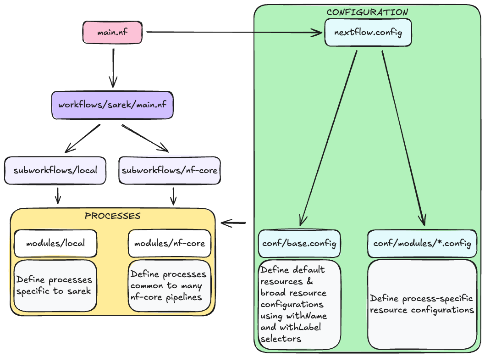

# 1.6 Intro to nf-core

!!! info "Learning objectives"

    - Understand what nf-core is
    - Identify where to find and access nf-core pipelines
    - Recognise the basic structure and key components of an nf-core workflow

We have now seen how a Nextflow pipeline can be configured to run on an HPC. In tomorrow's section of the workshop, we will further explore optimising a custom Nextflow pipeline to efficiently utilise HPC resources. However, whenever you are considering building a workflow, it is always important to check whether a suitable tool already exists - after all, the goal of Nextflow is to build reproducible workflows, and we shouldn't re-invent the wheel if we don't have to! For the rest of this session, we will be looking at the **nf-core** project, which aims to address this very issue and provide a collection of bioinformatics Nextflow pipelines.

## 1.6.1 What is nf-core?


nf-core is a community-driven effort to develop and curate open-source bioinformatics workflows built with Nextflow.

The project has a standardised set of best practices, guidelines, and templates for building modular, scalable, and portable bioinformatics workflows. Every workflow is well-documented, tested, and designed to work across multiple platforms, including cloud and HPC.

The key Features of nf-core workflows are:

- Documentation: nf-core workflows have extensive documentation covering installation, usage, and description of output files to ensure that you won’t be left in the dark.
- CI Testing: Every time a change is made to the workflow code, nf-core workflows use continuous-integration testing to ensure that nothing has broken.
- Stable Releases: nf-core workflows use GitHub releases to tag stable versions of the code and software, making workflow runs totally reproducible.
- Packaged software: Pipeline dependencies are automatically downloaded and handled using Docker, Singularity, Conda, or other software management tools. There is no need for any software installations.
- Portablility and reproducibility: nf-core workflows follow best practices to ensure maximum portability and reproducibility. The large community makes the workflows exceptionally well-tested and easy to execute.
- Cloud-ready: nf-core workflows are tested on AWS after every major release. You can even browse results live on the website and use outputs for your own benchmarking.

nf-core is published in Nature Biotechnology: [Nat Biotechnol 38, 276–278 (2020). Nature Biotechnology](https://www.nature.com/articles/s41587-020-0439-x)

## 1.6.2 Where to find nf-core pipelines

The nf-core website - [https://nf-co.re](https://nf-co.re) - hosts a list of all of the current nf-core pipelines, as well as their documentation, information for developers and users, and links to community forums, training sessions, and more.

The full list of available piplines are available at [https://nf-co.re/pipelines/](https://nf-co.re/pipelines/), and at the time of writing, this includes 84 stable workflows, 44 more that are under development, and 12 that have been archived.

Each workflow has a dedicated page that includes expansive documentation that is split into 6 sections:

- Introduction: An introduction and overview of the workflow
- Usage: Documentation and descriptions of how to execute the workflow
- Parameters: Documentation for all workflow parameters
- Output: Descriptions and examples of the expected output files
- Results: Example output files generated from the full test dataset on AWS
- Releases: Workflow version history

All of the workflow code is hosted on GitHub under the `nf-core` project. For example, today we will be working with the `sarek` pipeline, which is hosted on GitHub at [https://github.com/nf-core/sarek](https://github.com/nf-core/sarek). Helpfully, unless you are actively developing workflow code yourself, you usually won’t need to clone the workflow code from GitHub; instead, you can use Nextflow’s built-in functionality to pull a workflow:

```bash
nextflow pull nf-core/<pipeline>
```

Nextflow's `run` command will also automatically pull the workflow if it was not already available locally:

```bash
nextflow run nf-core/<pipeline>
```

By default, Nextflow will pull the default git branch of the pipeline unless a specific version is specified with the `-revision` or `-r` flag.

**Note** that in today's workshop, for full transparency and consistency, we **will** be pulling the pipeline directly from GitHub rather than using the shortcut method above.

## 1.6.3 Introducing today's pipeline: `nf-core/sarek`

As mentioned above, the rest of today's workshop will be focussing on the `nf-core/sarek` pipeline. As part of the [workshop setup](./01_0_intro.md#102-setup-the-workspace), the pipeline source code was downloaded into your workspace. You should see the `sarek/` folder in your current directory:

```bash
ls -1
```

```console title="Output" hl_lines="3"
config/
README.md
sarek/
scripts/
singularity/
```

The `nf-core/sarek` pipeline is a large workflow dedicated to performing variant calling on genome sequencing data. It is highly configurable and incoroprates a wide variety of tools and methods for detecting both germline and somatic variants.


The pipeline consists of three main stages:

- Pre-processing: This stage takes in sequencing FASTQ files and performs quality control, read trimming, genome alignment (also called mapping), marking of duplicate reads, and recalibrating base quality scores.
- Variant calling: This is the main workhorse of the pipeline and is the part that actually detects germline and/or somatic variants in the sequencing data. It uses several tools to achieve this, including `deepvariant`, `bcftools`, and the `GATK` suite.
- Annotation: This stage takes the variants that were called and annotates them using public databases. Annotations include the predicted effects of the variants, such as potential frameshift or stop-gain mutations, and their clinical relevance.

As you can imagine, this is a very complex pipeline with lots of options and parameters, and could take a long time to run in its default mode. Luckily, it also includes a wide range of options for selecting which parts of the pipeline to run or skip. We will be making heavy use of these options today so that we can just run a small section of the workflow.

We will be providing the pipeline with FASTQ files and just running the `mapping` part of the pre-processing stage. This takes in raw sequencing reads in the FASTQ format and aligns those reads to positions in the genome. The actualy implementation of this in `sarek` involves a few key stages:

1. `FASTQC`: This runs `fastqc` for generating quality control reports for the input sequencing data. This is the exact same tool we used in the earlier lessons.
2. `FASTP`: The `fastp` tool is a bit of a Swiss Army Knife, and does a number of different tasks, including quality-based filtering and trimming of sequencing reads, splitting reads into multiple FASTQ files, and quality control reporting (similar to `fastqc`). The splitting of FASTQ reads is particularly useful as it can be used for parallel processing in a scatter-gather pattern.
3. `TABIX_BGZIPTABIX_INTERVAL_COMBINED`: This creates a compressed `.gz` file of an **intervals** file and additionally indexes it. Intervals files are another common file in genomics used to easily specify genomic regions of interest.
4. `BWAMEM1_MEM`: This runs the tool `bwa mem` to perform the actual alignment of reads to the genome. This will run once for every split FASTQ file generated by `FASTP`.
5. `MERGE_BAM`: This performs the "gather" part of the scatter-gather pattern. Once the reads from each FASTQ have been aligned, the resulting BAM files are merged back into a single file per sample.
6. `INDEX_MERGE_BAM`: This creates an index of the final BAM file for each sample. Indexes are important for quickly searching through large sequencing datasets.
7. `BAM_TO_CRAM_MAPPING`: This creates a CRAM file from the final BAM file per sample. CRAM files are **compressed** BAM files, and are common in genomics, where data sets are typically very large.
8. `MULTIQC`: This run the `multiqc` tool to generate a final summary report of the whole pipeline run.


??? example "Additional content: the structure of a typical nf-core pipeline"

    For those who are interested in diving a bit deeper into the structure of an nf-core pipeline, let's list the directory structure of the `sarek` pipeline:

    ```bash
    ls sarek/
    ```

    ```console title="Output"
    assets/
    bin/
    CHANGELOG.md
    CITATIONS.md
    CODE_OF_CONDUCT.md
    conf/
    docs/
    LICENSE
    main.nf
    modules/
    modules.json
    nextflow_schema.json
    nextflow.config
    nf-test.config
    README.md
    subworkflows/
    tests/
    tower.yml
    workflows/
    ```

    You will see that there are quite a lot of files and folders. Some of these are simply housekeeping like the `LICENCE`, `CHANGELOG.md`, `CITATIONS.md`, and `CODE_OF_CONDUCT.md` files. The most important files and folders that we are interested in are described below:

    | File/folder | Description |
    | ----------- | ----------- |
    | main.nf | This is the entry point to workflow and the actual script that needs to be run to execute the pipeline. It is used primarily to define and initialise various parameters relevant to the pipeline. |
    | workflows/ | This folder houses the actual `sarek` workflow, which is called from `main.nf` |
    | subworkflows/ | This folder houses smaller, self-contained, modular workflows that are called within the greater `sarek` pipeline |
    | modules/ | This houses Nextflow files that define individual processes. Breaking up your processes into modules like this is considered best practice. |
    | conf/ | This houses configuration files specific to various modules in the pipeline |
    | nextflow.config | This is the default configuration file and defines default parameters and profiles, and imports the module-specific configuration files defined in `conf/` |
    | bin/ | The `bin/` folder can house executable scripts that can be called directly from your Nextflow processes. In `sarek`, the only executable script in here is a python script to generate licence messages. |

    Diving a little deeper, you will see that the `modules/` and `subworkflows/` directories both contain two sub-folders: `local/` and `nf-core/`:

    ```bash
    ls sarek/modules sarek/subworkflows
    ```

    ```console title="Output"
    sarek/modules:
    local   nf-core

    sarek/subworkflows:
    local   nf-core
    ```

    Any modules and sub-workflows that originated from the [nf-core GitHub repository](https://github.com/nf-core/modules) will be placed in the `nf-core` sub-folder, and typically represent common tools and workflows that are useful in many pipelines. The `local` sub-folders, on the other hand, are for processes that were developed specificially for the current pipeline.

    

    As you can see, nf-core pipelines can be quite complex. This is due to the attempt to heavily standardise and modularise these workflows. There are significant benefits to this, primarily in that it gives everyone a common template to work from and helps to break down the workflows into smaller, more manageable and maintainable chunks. However, it can also make it difficult to analyse and troubleshoot the code when developing them.

    The configuration for `nf-core/sarek` is split up into many different files. The main configuration file, `nextflow.config`, is set up to:

    - Define and set the defaults for various parameters, including input files and the reference genome.
    - Define several **profiles** that specify groups of settings important for various backends like docker, singularity, and conda. There are also several test profiles defined.
    - Import module-specific configuration files.

    One of the major configuration files that is importedby `nextflow.config` is `conf/base.config`. This file defines the default resources for processes, as well as resources that are applied to many processes at once with the `withLabel` and `withName` selectors:

    ```groovy title="Default resource configuration in conf/base.config" linenums="11"
    process {

        // TODO nf-core: Check the defaults for all processes
        cpus   = { 1      * task.attempt }
        memory = { 6.GB   * task.attempt }
        time   = { 4.h    * task.attempt }
    ```

    ```groovy title="Specific resource configuration for FASTP in conf/base.config" linenums="66"
    withName: 'FASTP'{
        cpus   = { 12   * task.attempt }
        memory = { 4.GB * task.attempt }
    }
    ```

    ```groovy title="Resource configuration fo the 'process_medium' label in conf/base.config" linenums="42"
    withLabel:process_medium {
        cpus   = { 6     * task.attempt }
        memory = { 36.GB * task.attempt }
        time   = { 8.h   * task.attempt }
    }
    ```

    This highlights the **layered** nature of Nextflow's configuration; initially, sensible default values for CPUs, memory, and walltime are defined, followed by more specific values for jobs that have different computational requirements, e.g. more CPUs but less memory for the `FASTP` process.

    Note also the use of the curly braces and the `* task.attempt` in each line. This is an example of a **dynamically calculated resource**. Nextflow keeps track of how many times a given task has been attempted and stores it in the variable `task.attempt`; this can be used in case of a failure to increase the required resources on the next try. In this case, by default, jobs will be given 1 CPU, 6GB of memory, and 4h of walltime on the first try; on the second try, they will get 2 CPUs, 12GB of memory, and 8h of time. `conf/base.config` also sets `maxRetries = 1`, so this will only happen the one time, and failures won't cause an infinite loop of retries.

    !!! warning "The pros and cons of task.attempt"

        While `task.attempt` can be very useful for re-trying a process with more resources when it fails, it is a somewhat crude method of doing so. Doubling your resources upon failure will also double the cost of running the job. Where possible, you should try to be more nuanced with such dynamic requests and identify during development which resources are the limiting factors for a process. You can also try different approaches to increasing a resource with each attempt, such as adding a small amount each time, rather than doubling:

        `memory = { 32.GB + 4.GB * task.attempt }`

        A more advanced method is to calculate the size of input files within the process definition and adjust the resources required accordingly:

        ```groovy
        process TEST {

            // Get the input file size (in bytes) and add a 1 GB buffer
            memory { x.size().B + 1.GB }

            input:
            path x

            ...

        }
        ```

Let's now move to the next section, where we will write a script to run the pipeline!
