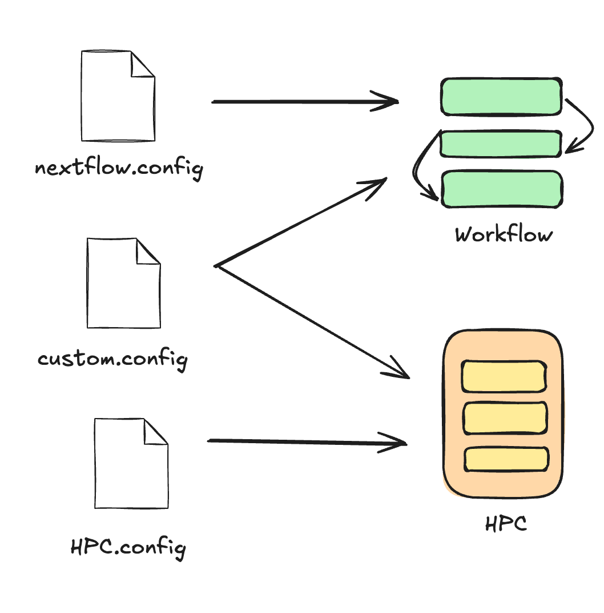

# Running a custom pipeline on HPC

!!! info "Learning objectives"

    - Identify best practices for benchmarking and configuring pipelines,
    step-by-step
    - Troubleshoot common HPC and scheduling errors by inspecting task logs
    and interpretting exit codes and error messages
    - Know how to find and specify system-dependent HPC values such as queues/partitions
    - Recall how Nextflow interacts with HPC components

TODO these learning objectives arent accurate, update them

!!! warning "Testing and developing in the right environment"

    For the workshop, we have pre-pulled containers and use them from the cache,
    and as data is small and the workflow runs quickly, we will be running them
    on login nodes.
    
    We recommend using **interactive jobs** for testing and debugging 
    workflows directly on compute nodes instead of the login nodes. Alternatively, 
    if you want to schedule your Nextflow head job, ensure that your `run.sh` 
    script includes the appropriate scheduler options.

    See the recommendations on running the head job for [Gadi](https://opus.nci.org.au/spaces/Help/pages/241926895/Persistent+Sessions) and [Setonix](https://pawsey.atlassian.net/wiki/spaces/US/pages/286097469/How+to+Run+Workflows+on+the+Workflow+Nodes).

It is useful to develop your pipelines using a small, representative subset of your data. This allows you:

- Rapidly iterate your workflow design
- Validate environment and software set up
- Tune pipeline configuration without burning service units
- Reduce queue wait times
- Estimate basic performance characteristics of each process

## 2.1.1 Run without configuration

We will start configuring our custom pipeline with using a subset of raw reads from a single individual (NA1287) in our sample cohort. This is a good proxy for the other two samples as they all contain the same subset of chromosomes (20, 21, and 22) and have been sequenced to the same depth. Once we’re confident everything works as intended, we will scale up to run on the full dataset.

Let's start by running the pipeline out of the box to identify what we need to configure: 


!!! example "Exercise"

    1. Load the Nextflow module, following the same method we learnt yesterday:

    === "Gadi (PBSpro)"
        ```bash
        module load nextflow/24.04.5 
        ```

    === "Setonix (Slurm)"
        ```bash
        module load nextflow/24.10.0
        ```

    2. Run your Nextflow command out of the box:

    === "Gadi (PBSpro)"

        ```bash
        nextflow run main.nf
        ```

        ??? abstract "Output"

            ```
            N E X T F L O W   ~  version 24.04.5

            Launching `main.nf` [suspicious_almeida] DSL2 - revision: 5e5c4f57e0

            executor >  local (2)
            [a3/a6da06] FASTQC (fastqc on NA12877) [100%] 1 of 1, failed: 1 ✘
            [16/860647] ALIGN (1)                  [100%] 1 of 1, failed: 1 ✘
            [-        ] GENOTYPE                   -
            [-        ] JOINT_GENOTYPE             -
            [-        ] STATS                      -
            [-        ] MULTIQC                    -
            ERROR ~ Error executing process > 'FASTQC (fastqc on NA12877)'

            Caused by:
            Process `FASTQC (fastqc on NA12877)` terminated with an error exit status (127)


            Command executed:

            mkdir -p "fastqc_NA12877"
            fastqc -t 1 --outdir "fastqc_NA12877" --format fastq NA12877_chr20-22.R1.fq.gz NA12877_chr20-22.R2.fq.gz

            Command exit status:
            127

            Command output:
            (empty)

            Command error:
            .command.sh: line 3: fastqc: command not found

            Work dir:
            /scratch/project/username/nextflow-on-hpc-materials/part2/work/a3/a6da061dd65d454add3f000923235d

            Tip: when you have fixed the problem you can continue the execution adding the option `-resume` to the run command line

            -- Check '.nextflow.log' file for details
            ```

    === "Setonix (Slurm)"

        ```bash
        nextflow run main.nf
        ```

        ??? abstract "Output"

            ```console
             N E X T F L O W   ~  version 24.10.0

            Launching `main.nf` [trusting_brown] DSL2 - revision: 5e5c4f57e0

            executor >  local (2)
            executor >  local (2)
            [e6/21a49e] FASTQC (fastqc on NA12877) [100%] 1 of 1, failed: 1 ✘
            [68/bda517] ALIGN (1)                  [100%] 1 of 1, failed: 1 ✘
            [-        ] GENOTYPE                   -
            [-        ] JOINT_GENOTYPE             -
            [-        ] STATS                      -
            [-        ] MULTIQC                    -
            ERROR ~ Error executing process > 'ALIGN (1)'

            Caused by:
            Process `ALIGN (1)` terminated with an error exit status (127)


            Command executed:

            bwa mem -t 1 -R "@RG\tID:NA12877\tPL:ILLUMINA\tPU:NA12877\tSM:NA12877\tLB:NA12877\tCN:SEQ_CENTRE" ref/Hg38.subsetchr20-22.fasta NA12877_chr20-22.R1.fq.gz NA12877_chr20-22.R2.fq.gz | samtools sort -O bam -o NA12877.bam
            samtools index NA12877.bam

            Command exit status:
            127

            Command output:
            (empty)

            Command error:
            .command.sh: line 2: samtools: command not found
            .command.sh: line 2: bwa: command not found

            Work dir:
            /scratch/project/username/nextflow-on-hpc-materials/part2/work/68/bda517eeaa47f5ba24a9c401bdeb0e

            Tip: view the complete command output by changing to the process work dir and entering the command `cat .command.out`

            -- Check '.nextflow.log' file for details
            ```

!!! question "Why did it fail?"
    Use the output printed to your screen, `.nextflow.log` file in your current directory, and `.command` files in the work directory of the failed task to identify what caused your workflow run to fail. 

    ??? abstract "Answer"
        Our run stopped because one or more processes failed. [Exit status `127` in Linux environments](https://linuxconfig.org/how-to-fix-bash-127-error-return-code) means your system was not able to find the command referenced in the process. This suggests the software is not available in our environment. 

## 2.1.2 And run with containers

All our process modules specify a container to run inside. This can only happen if Singularity is explicitly enabled in our configuration. Let's enable this in our system-specific configuration files and attempt to run again:  

!!! example "Exercise"

    Load the Singularity modules, following the same method we learnt yesterday:

    === "Gadi (PBSpro)"
        ```bash
        module load singularity
        ```

    === "Setonix (Slurm)"
        ```bash
        module load singularity/4.1.0-slurm
        ```

    Add the following to your system-specific config file that you can find in `config/`. Remember, we have already enabled profiles in our `nextflow.config`, so no need to edit that file. 

    === "Gadi (PBSpro)"
        ```groovy title="config/pbspro.sh"
        params.pbspro_account = ""

        process {
            // Load the globally installed singularity module before running any process
            module = 'singularity'
        }

        singularity {
            // Explicitly turns on container execution
            enabled = true
            // Automatically bind-mount working directory on scratch and common system paths
            autoMounts = true
            // Define location of stored container images 
            cacheDir = "/scratch/${System.getenv('PROJECT')}/${System.getenv('USER')}/nextflow-on-hpc-materials/singularity"
        }
        ```

    === "Setonix (Slurm)"
        ```groovy title="config/slurm.config"
        params.slurm_account = ""

        process {
            // Load the globally installed singularity/4.1.0-slurm module before running any process
            module = 'singularity/4.1.0-slurm'
        }

        singularity {
            // Explicitly turns on container execution
            enabled = true
            // Automatically bind-mount working directory on scratch and common system paths
            autoMounts = true
            // Define location of stored container images 
            cacheDir = "/scratch/${System.getenv('PAWSEY_PROJECT')}/${System.getenv('USER')}/nextflow-on-hpc-materials/singularity"
        }
        ```

    3. Run your updated Nextflow command:

    === "Gadi (PBSpro)"

        ```bash
        nextflow run main.nf -profile pbspro --pbspro_account vp91
        ```

        ??? abstract "Output"

            ```
            executor >  pbspro (5)
            [e4/dc7852] FASTQC (fastqc on NA12889) | 3 of 3 ✔
            [3f/c0e6ae] ALIGN (1)                  | 1 of 1 ✔
            [d0/6677c4] GENOTYPE (1)               | 1 of 1, failed: 1 ✘
            [-        ] JOINT_GENOTYPE             -
            [-        ] STATS                      -
            [-        ] MULTIQC                    | 0 of 1
            ERROR ~ Error executing process > 'GENOTYPE (1)'

            Caused by:
              Process `GENOTYPE (1)` terminated with an error exit status (247)


            Command executed:

              gatk --java-options "-Xmx4g" HaplotypeCaller -R Hg38.subsetchr20-22.fasta -I NA12877.bam -O NA12877.g.vcf.gz -ERC GVCF

            Command exit status:
              247

            Command output:
              (empty)

            Command error:
            ```

    === "Setonix (Slurm)"

        ```bash
        nextflow run main.nf -profile slurm --slurm_account courses01
        ```

        ??? abstract "Output"

            ```console
            N E X T F L O W   ~  version 24.10.0                 14:13:57

            Launching `main.nf` [dreamy_cuvier] DSL2 - revision: 5e5c4f57e0

            executor >  slurm (8)
            [c4/babfde] FASTQC (fastqc on NA12877) | 3 of 3 ✔
            [6f/7a523b] ALIGN (1)                  | 1 of 1 ✔
            [bf/525fc9] GENOTYPE (1)               | 1 of 1 ✔
            [5c/ea7cb0] JOINT_GENOTYPE (1)         | 1 of 1 ✔
            [7f/4e64dc] STATS (1)                  | 1 of 1 ✔
            [70/254c9e] MULTIQC                    | 1 of 1 ✔
            
            Completed at: 05-Nov-2025 13:59:02
            Duration    : 2m 21s
            CPU hours   : (a few seconds)
            Succeeded   : 8
            ```

!!! question "Zoom react!"

    1. If your job has finished succesfully, react "Yes" on Zoom, and "No" if it returned an error
    2. Similarly, react "Yes" if you are running it on Gadi, and "No" for Setonix

Although both systems run Nextflow with Singularity, Gadi and Setonix have different environmental variables, filesystem layouts, job schedulers, queue structures, module names, and container cache behaviour. These differences affect how Nextflow executes each process. 

Let's explore what resources were actually used and compare them to what was allocated, by inspecting the logs and system job information using the methods from Part 1.

We will use the respective job scheduler introspection tools to observe the resources used on both both systems.

!!! example "Exercises"

    Find the Job ID of the failed or completed `GENOTYPE` process in your `.nextflow.log`:

    ```bash
    grep GENOTYPE .nextflow.log | grep jobId
    ```

    The output should look something like:
    ```console
    Nov-11 12:26:17.249 [Task submitter] DEBUG nextflow.executor.GridTaskHandler - [PBSPRO] submitted process GENOTYPE (1) > jobId: 154278383.gadi-pbs; workDir: /scratch/ad78/fj9712/nextflow-on-hpc-materials/part2/work/0b/465f7eacfa500698687ff12df65060
    Nov-11 12:27:47.144 [Task monitor] DEBUG n.processor.TaskPollingMonitor - Task completed > TaskHandler[jobI d: 154278383.gadi-pbs; id: 5; name: GENOTYPE (1); status: COMPLETED; exit: 0; error: -; workDir: /scratch/a d78/fj9712/nextflow-on-hpc-materials/part2/work/0b/465f7eacfa500698687ff12df65060 started: 1762828007140; exited: 2025-11-11T02:27:35Z; ]
    ```

    The value we need in this example is `154278383` - this corresponds to the job id that was scheduled.

    Then, inspect the job resource usage. There are different tools used for different schedulers.

    === "Gadi (PBSpro)"

        Use `qstat -xf <job_id>` to query for the resource usage and allocation

        ```bash
        qstat -xf <job_id>
        ```
        ```console
        Job Id: 154038474.gadi-pbs
        Job_Name = nf-GENOTYPE_1
        Job_Owner = fj9712@gadi-login-05.gadi.nci.org.au
        resources_used.cpupercent = 94
        resources_used.cput = 00:02:50
        resources_used.jobfs = 0b
        resources_used.mem = 512124kb
        resources_used.ncpus = 1
        resources_used.vmem = 512124kb
        resources_used.walltime = 00:03:03
        job_state = F
        queue = normal-exec
        ...
        ```

    === "Setonix (Slurm)"

        Use `sacct` with formatting to view key stats related to resource usage:

        ```bash
        sacct -j <job_id> --format=JobID,JobName,User,CPUTime,TotalCPU,NCPUS,Elapsed,State,MaxRSS,MaxVMSize,Partition
        ```
        ```console
        JobID           JobName      User    CPUTime   TotalCPU      NCPUS    Elapsed      State     MaxRSS  MaxVMSize  Partition
        ------------ ---------- --------- ---------- ---------- ---------- ---------- ---------- ---------- ---------- ----------
        34325657     nf-GENOTY+     fjaya   00:01:50  01:07.026          2   00:00:55  COMPLETED                             work
        34325657.ba+      batch             00:01:50  01:07.023          2   00:00:55  COMPLETED   1566932K          0
        34325657.ex+     extern             00:01:50  00:00.003          2   00:00:55  COMPLETED          0          0
        ```

In both cases, we can observe that the jobs were assigned the following resources:

|         | CPU   | Memory   |
| ------- | ----- | -------- |
| Gadi    | 1     | 512 MB   |
| Setonix | 2     | 1.6 GB   |

This is why **explicit resource configuration** is important. Even though the pipeline technically ran (or failed), these defaults are unsuitable for real data.

In this case, it shows that the `GENOTYPE` process needs at least 2 GB of memory. Let's explicitly configure that in the next step.

## 2.1.3 Why do we have so many configuration files?



[TODO] update figure

We use three different configuration files to keep our Nextflow workflows reproducible, modular, and portable across different systems. 
This setup not only ensures consistency when running the same pipeline in different environments, but also allows reuse of configuration components across multiple pipelines.

Each configuration file serves a distinct purpose:

- `nextflow.config` is the main configuration file that defines the core behaviour of the workflow itself (e.g. main.nf). It includes parameters (params), and references to profiles. To maintain reproducibility, **this file should not be modified during system-specific tuning**. It should only change if the underlying workflow logic changes - that is, what gets run.

- `config/pbspro.config` and `config/slurm.config` define how the pipeline should run on a particular type of HPC system. These files specify details such as which executor to use (e.g. PBS Pro or SLURM), whether to use Singularity or Docker, and other runtime behaviour. They do not control the internal logic of the pipeline. These files should be tailored to match the requirements and setup of the HPC infrastructure you are targeting.

- `config/custom.config` is where we bring it all together. This file contains system-specific process settings such as CPU and memory requests. It links what the workflow does with how it runs on a specific system. When developing or adapting a custom pipeline for an HPC environment, this is typically where most tuning happens to fit the specific node architecture, queue constraints, and resource optimisation.

While this structure is a useful starting point, it is not the only way to structure your configuration. The nf-core community have their own set of standards with some presets for some instutitions (there are ones available for Gadi and Setonix!). However, it is important to double check that these configs are suitable and optimal for your purposes. For more information see [nf-core/configs](https://nf-co.re/configs/)

## 2.1.4 Minimal configuration to run on HPC

We will continue to get the pipeline running with a minimum viable configuration. This serves as a baseline to confirm everything is working correctly (such as scheduling, containers are enabled, etc.), prior to any fine tuning. We want to ensure that:

- Jobs are being scheduled correctly
- All process tasks and the pipeline complete successfully

!!! note

    In Part 2 we will use the same queues and partitions:

    - The `normalbw` queue on Gadi
    - The `work` partition on Pawsey

    These are low-cost queues suitable for general compute jobs.

    Here we assign the average number of cores available based on memory
    requirements. This will be revisited in the resourcing section.

!!! example "Exercises"

    1. Create a new file `config/custom.config`

        ```bash
        touch config/custom.config
        ```

    2. Add the following contents based on your HPC

    === "Gadi (PBSpro)"

        ```groovy title='custom.config'
        process {
            cpu = 1 // 'normalbw' queue = 128 GB / 28 CPU ~ 4.6 OR 9.1
            memory = 4.GB
        }
        ```

    === "Setonix (Slurm)"

        ```groovy title='custom.config'
        process {
            cpu = 1 // 'work' partition = 230 GB / 128 CPU ~ 1.8
            memory = 2.GB
        }
        ```

Recall from Part 1 that Nextflow's executor is the part of the workflow engine that talks to the computing environment (whether it's a laptop or HPC). When running on a shared HPC system, these settings are important to include so you don't overwhelm the system (`queueSize`, `pollInterval`, `queueStatInterval`), or generate duplicated files in excess (`cache`, `stageInMode`), or run things in the wrong place (options).

!!! example "Exercises"

    Open the pbspro.config or slurm.config and edit. We will add these HPC-friendly options.

    === "Gadi (PBSpro)"

        ```groovy title="config/pbspro.config" hl_lines="3 4 5 6 7 8 15 16 17"
        params.pbspro_account = ""

        executor {
            // For high-throughput jobs, these values should be higher
            queueSize = 30
            pollInterval = '5 sec'
            queueStatInterval = '5 sec'
        }

        process {
            executor = 'pbspro'
            module = 'singularity'
            queue = 'normalbw'
            clusterOptions = "-P ${System.getenv('PROJECT')}"
            storage = "scratch/${System.getenv('PROJECT')}"
            cache = 'lenient'
            stageInMode = 'symlink'
        }

        singularity {
            enabled = true
            autoMounts = true
            cacheDir = "/scratch/${System.getenv('PROJECT')}/${System.getenv('USER')}/nextflow-on-hpc-materials/singularity"
        }
        ```

    === "Setonix (Slurm)"

        ```groovy title="config/slurm.config" hl_lines="3 4 5 6 7 8 15 16"
        params.slurm_account = ""

        executor {
            // For high-throughput jobs, these values should be higher
            queueSize = 30
            pollInterval = '5 sec'
            queueStatInterval = '5 sec'
        }

        process {
            executor = 'slurm'
            module = 'singularity/4.1.0-slurm'
            queue = 'work'
            clusterOptions = "--account=${System.getenv('PAWSEY_PROJECT')}"
            cache = 'lenient'
            stageInMode = 'symlink'
        }

        singularity {
            enabled = true
            autoMounts = true
            cacheDir = "/scratch/${System.getenv('PAWSEY_PROJECT')}/${System.getenv('USER')}/nextflow-on-hpc-materials/singularity"
        }
        ```

While we could manually run the Nextflow command each time, using a run script can reduce human error (missing a flag, typos) and is easier to re-run. This is especially useful in the testing and benchmarking stages.

!!! example "Exercises"

    1. Create a new file called `run.sh`

        ```bash
        touch run.sh
        ```

    2. Copy and paste the following code based on your HPC:

    === "Gadi (PBSpro)"

        ```groovy title="run.sh"
        #!/bin/bash

        module load nextflow/24.04.5
        module load singularity

        nextflow run main.nf -profile pbspro --pbspro_account vp91 -c config/custom.config
        ```

    === "Setonix (Slurm)"

        ```groovy title="run.sh"
        #!/bin/bash

        module load nextflow/24.10.0
        module load singularity/4.1.0-slurm

        nextflow run main.nf -profile slurm --slurm_account courses01 -c config/custom.config
        ```

    3. Save the run.sh file (Windows: Ctrl+S, macOS: Cmd+S).
    4. Provide execute permission by running

        ```bash
        chmod +x run.sh
        ```

!!! example "Exercise"

    Run your newly configured pipeline using by executing `./run.sh` in the terminal.
    ??? note "Results"

        On both Gadi and Setonix, both runs should now be successful and
        executed on the respective scheduler.


        === "Gadi (PBSpro)"

            ```bash
            Loading nextflow/24.04.5
            Loading requirement: java/jdk-17.0.2

             N E X T F L O W   ~  version 24.04.5

            Launching `main.nf` [determined_picasso] DSL2 - revision: 5e5c4f57e0

            executor >  pbspro (6)
            [7b/16f7c2] FASTQC (fastqc on NA12877) | 1 of 1 ✔
            [ec/5fd924] ALIGN (1)                  | 1 of 1 ✔
            [17/803fe5] GENOTYPE (1)               | 1 of 1 ✔
            [0f/e21d58] JOINT_GENOTYPE (1)         | 1 of 1 ✔
            [40/0c6e28] STATS (1)                  | 1 of 1 ✔
            [6a/94910b] MULTIQC                    | 1 of 1 ✔
            Completed at: 10-Nov-2025 12:19:38
            Duration    : 4m 1s
            CPU hours   : (a few seconds)
            Succeeded   : 6
            ```

        === "Pawsey (Slurm)"


            ```bash
             N E X T F L O W   ~  version 24.10.0

            Launching `main.nf` [nostalgic_bell] DSL2 - revision: 5e5c4f57e0

            executor >  slurm (6)
            [a4/1eae6a] FASTQC (fastqc on NA12877) [100%] 1 of 1 ✔
            [76/9e6fca] ALIGN (1)                  [100%] 1 of 1 ✔
            [96/f57a2e] GENOTYPE (1)               [100%] 1 of 1 ✔
            [ec/547a9c] JOINT_GENOTYPE (1)         [100%] 1 of 1 ✔
            [88/b49a40] STATS (1)                  [100%] 1 of 1 ✔
            [8d/b5b351] MULTIQC                    [100%] 1 of 1 ✔
            Completed at: 10-Nov-2025 10:28:08
            Duration    : 3m 31s
            CPU hours   : (a few seconds)
            Succeeded   : 6
            ```

## Summary

You’ve now built the scaffolding needed to begin fine-tuning your resource requests and exploring monitoring and optimisation techniques. In the next section, we'll start measuring actual resource usage and configuring processes more precisely for efficient use for the specific HPC system.