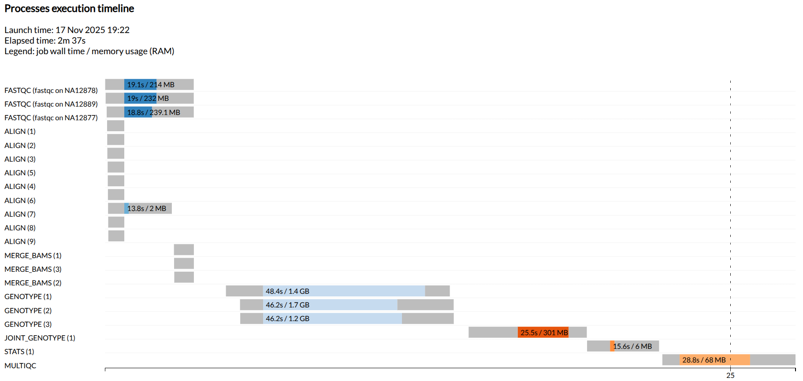

# Scale to multiple samples

!!! info "Learning objectives"

    - Apply an optimised pipeline across multiple samples
    - Understand sample-level and within-sample parallelism
    - Recall best practices for running multi-sample data with samplesheets

Now that we have a pipeline that runs successfully and configured for a representative sample, we will now run it on multiple samples.

Nextflow's "dataflow" model and channels makes this easy to execute. Every additional sample can run independently, in parallel, using the same code and resources we've configured. For more information, refer to the Nextflow for the Life Science's explainers on [Queue Channels](https://sydney-informatics-hub.github.io/hello-nextflow-2025/part1/05_inputs/#queue-channels) and [input samplesheets](https://sydney-informatics-hub.github.io/hello-nextflow-2025/part2/02_fastqc/#223-reading-files-with-a-samplesheet).

We will now replace the samplesheet we used by modifying our run script with resume, so it runs only on the two new samples.

!!! example "Exercise"

    Update your `run.sh` and change the `--samplesheet` param to use `samplesheets_full.csv`:

    === "Gadi (PBS)"

        ```groovy title="run.sh"
        #!/bin/bash

        module load nextflow/24.04.5
        module load singularity

        nextflow run main.nf -profile pbspro -c config/custom.config --samplesheet "samplesheet_full.csv" -resume
        ```

    === "Setonix (Slurm)"

        ```groovy title="run.sh"
        #!/bin/bash

        module load nextflow/24.10.0
        module load singularity/4.1.0-slurm

        nextflow run main.nf -profile slurm -c config/custom.config --samplesheet "samplesheet_full.csv" -resume
        ```

    Save your script and re-run!

    ```bash
    ./run.sh
    ```

    Your output should now look something like this:

    === "Gadi (PBS)"

        ```console title="Output"
        N E X T F L O W   ~  version 24.04.5

        Launching `main.nf` [irreverent_hilbert] DSL2 - revision: 029efd6fbc

        executor >  pbspro (22)
        [8c/d3131f] FASTQC (fastqc on NA12889)             [100%] 3 of 3 ✔
        [82/38ccb6] SPLIT_FASTQ (split fastqs for NA12877) [100%] 3 of 3 ✔
        [e2/7a1203] ALIGN_CHUNK (2)                        [100%] 9 of 9 ✔
        [48/38ee62] MERGE_BAMS (3)                         [100%] 3 of 3 ✔
        [28/88ea07] GENOTYPE (1)                           [100%] 3 of 3 ✔
        [31/bff8ce] JOINT_GENOTYPE (1)                     [100%] 1 of 1 ✔
        [e0/2769b4] STATS (1)                              [100%] 1 of 1 ✔
        [de/544e91] MULTIQC                                [100%] 1 of 1 ✔
        Completed at: 12-Nov-2025 09:34:02
        Duration    : 6m 2s
        CPU hours   : 0.1
        Succeeded   : 22
        ```

    === "Setonix (Slurm)"

        ```console title="Output"
        N E X T F L O W   ~  version 24.10.0

        Launching `main.nf` [fabulous_panini] DSL2 - revision: 029efd6fbc

        executor >  slurm (22)
        [e6/da7692] FASTQC (fastqc on NA12877)             [100%] 3 of 3 ✔
        [f0/fadc47] SPLIT_FASTQ (split fastqs for NA12878) [100%] 3 of 3 ✔
        [74/bced2a] ALIGN_CHUNK (6)                        [100%] 9 of 9 ✔
        [84/1bd560] MERGE_BAMS (1)                         [100%] 3 of 3 ✔
        [2f/2d96be] GENOTYPE (1)                           [100%] 3 of 3 ✔
        [b8/f88205] JOINT_GENOTYPE (1)                     [100%] 1 of 1 ✔
        [6e/165917] STATS (1)                              [100%] 1 of 1 ✔
        [65/432772] MULTIQC                                [100%] 1 of 1 ✔
        Completed at: 12-Nov-2025 07:32:34
        Duration    : 4m 32s
        CPU hours   : (a few seconds)
        Succeeded   : 22
        ```

!!! example "Exercise" 

    Download the timeline file to your local computer and view it in your local browser.

    Which processes were run in parallel?

    ??? abstract "Show timeline"

        

        

## Next steps

When developing and running workflows on "real" data, input data is rarely uniform. While the sample data used here was intentially consistent, actual data sets often contain variation in file size, formats, sequencing depth and libraries, or metadata. These differences can impact performance and potentially requires updating the workflow structure (`main.nf`, modules) to suit.

As you scale up, these differences may require you to re-configure parts of your workflow, for example, by using dynamic resourcing strategies from the previous lesson. Configuration is an iterative process - get it right for a representative sample, scale up, iterate and optimise as you go.