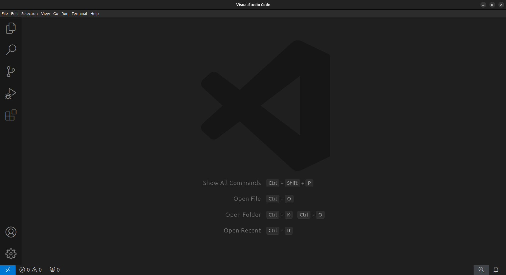
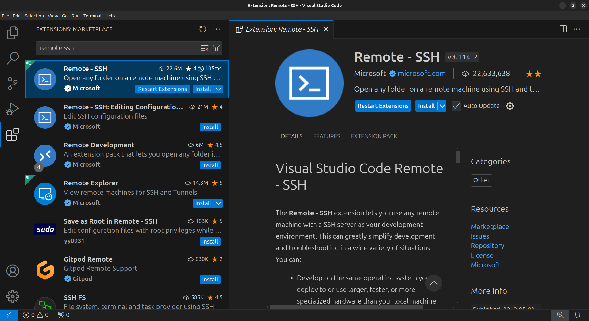
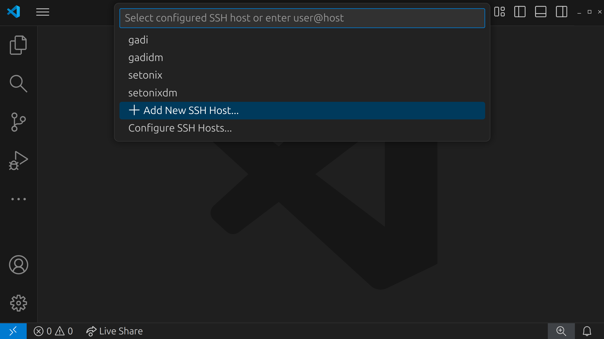
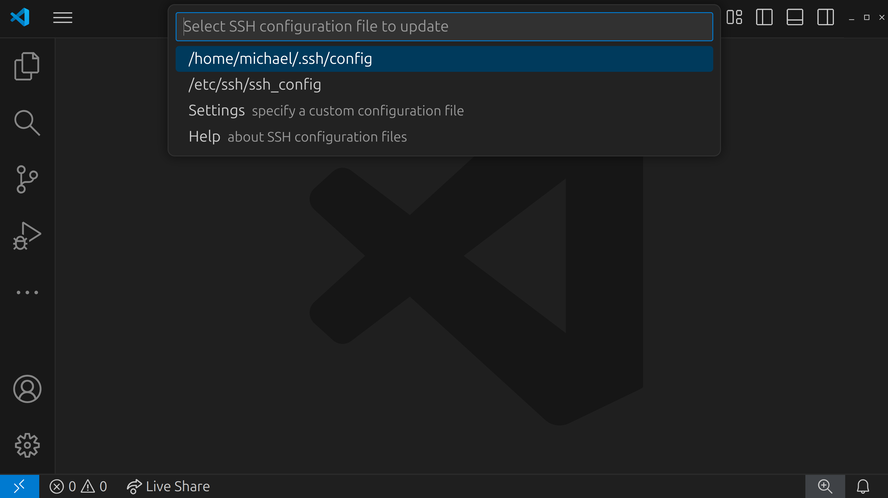
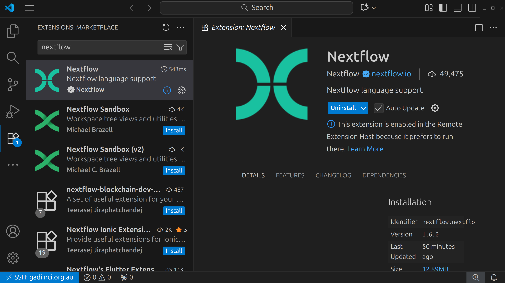

# Set up your computer

In this workshop, we will be using [Pawsey's Setonix HPC](https://pawsey.org.au/systems/setonix/) and [NCI's Gadi HPC](https://nci.org.au/our-systems/hpc-systems). 

The requirements for this workshop are a personal computer with:

- Visual Studio Code (VSCode)
- A web browser

Below, you will find instructions on how to set up VSCode and connect to the HPC system to which you've been assigned.

Each participant will be provided with their training account and password prior to the workshop.
Before the workshop, you must have the following:

1. VSCode installed
2. The necessary VSCode extensions installed
3. Be able to connect to your assigned HPC.

!!! info

    If you require assistance with the setup, please write in the discussion board on the [Google document]().

## Installing Visual Studio Code

Visual Studio Code (VSCode) is a versatile code editor that we will use for the
workshop. We will use VSCode to connect to the VM, navigate the directories,
edit, view and download files.

1. Download VSCode by following the [installation instructions](https://code.visualstudio.com/docs/setup/setup-overview) for your local Operating System.
2. Open VSCode to confirm it was installed correctly.

## Installing the VSCode extensions

Specific VSCode extensions are required to connect to the VM and make working with Nextflow files easier (i.e. syntax highlighting).

1. In the VSCode sidebar on the left, click on the extensions button (four blocks)

2. In the Extensions Marketplace search bar, search for `remote ssh`. Select **"Remote - SSH"**

    

3. Click on the blue `Install` button.

4. Once installed, you should see a blue bar in the bottom left corner of the screen. This means that the SSH extension was successfully installed.

5. Close the Extensions tab and sidebar

### Connecting to the HPCs

Ensure you have your training details of your assigned system.

1. Click the blue bar in the bottom left corner of the window. A menu will appear up the top of the window:

    

2. Click "Connect to Host..."

    

3. In the following text box, type the following command. **Note:** be sure to select the relevant tab below for your assinged platform ("Gadi (PBS)" or "Setonix (Slurm)"):

    === "Gadi (PBS)"

        `ssh <username>@gadi.nci.org.au`

         

    === "Setonix (Slurm)"

        `ssh <username>@setonix.pawsey.org.au`

        

4. Press the Enter key

5. In the next menu, you are prompted to select an SSH configuration file to update with the new settings. Select the one that is in your home directory.

    

6. You will see a confirmation message that the new host was successfully added.

    

7. Repeat steps 1 and 2 again, clicking on the blue SSH bar at the bottom left and selecting "Connect to Host..."

8. Click on the remote that you just added: this will be called `gadi.nci.org.au` for Gadi and `setonix.pawsey.org.au` for Setonix.

9. A new window will open and a prompt will appear at the top of the window asking for your password. Enter it here and press Enter.

10. A message will appear for a few moments saying "Setting up SSH Host... Initializing VS Code Server"

10. Once VS Code has been set up on the remote and you are successfully logged in, you will see the text `SSH: <hostname>` in the blue SSH box in the bottom left corner of the window, where `<hostname>` is either `gadi.nci.org.au` or `setonix.pawsey.org.au`, depending on your system.

    

### Installing the Nextflow extension

Once you have connected to your assigned HPC, you should also install the Nextflow extension, which provides syntax highlighting and can help identify any potential errors in your code. **Note** that this needs to be done **after** you have connected, as you are installing the extension on the **remote** computer, not your local computer or laptop.

1. Once again, click on the extensions button in the left sidebar (the icon with four blocks)

2. In the Extensions Marketplace search bar, search for `nextflow` and install the **"nextflow"** estension.

    

3. The Nextflow extension should now show as installed and the blue "Install" button has changed to "Uninstall". You should also now see a new icon in the left sidebar that looks like a curved X shape. This means that the Nextflow extension has been installed correctly. You can now close the extensions tab.

    
    

!!! success

    You have now configured VSCode for the workshop!